# 📘 Nephio Notes — Part 1: KPT, Porch & Configuration-as-Data

---

## 🧠 Core Philosophy: Why Nephio Exists

> **Problem:** Helm templates are hard to programmatically edit after rendering without making them impossibly complex.
>
> **Nephio's Answer:** Treat YAML like a **database**, not a template. Use **functions** (containerized programs) to read → modify → output YAML. This paradigm is called **Configuration as Data (CaD)**.

```mermaid
graph LR
    A["📄 Input YAML"] --> B["⚙️ KRM Function<br/>(Container)"]
    B --> C["📄 Output YAML"]
    style A fill:#2d3748,stroke:#63b3ed,color:#e2e8f0
    style B fill:#2d3748,stroke:#f6ad55,color:#e2e8f0
    style C fill:#2d3748,stroke:#68d391,color:#e2e8f0
```



This is called the **KRM (Kubernetes Resource Model) Pipeline**.

---

## 📦 KPT — Kubernetes Package Transformation

### What is KPT?

KPT is a CLI toolkit that treats Kubernetes configuration as **data** rather than code. Its core principles:

| Principle | Description |
|---|---|
| **Config = Source of Truth** | Configuration data is stored separately from the live state |
| **Uniform Data Model** | Uses a serializable, standard format (KRM) |
| **Separation of Concerns** | Code that acts on config is separate from the data itself |
| **Storage Abstraction** | Clients don't directly interact with Git/OCI — KPT does it for them |

### KPT Toolchain

```mermaid
graph TD
    KPT["🔧 KPT Toolchain"]
    KPT --> CLI["1️⃣ KPT CLI<br/>Command-line interface"]
    KPT --> SDK["2️⃣ Function SDK<br/>Create custom transform/<br/>validate functions"]
    KPT --> CAT["3️⃣ Function Catalog<br/>Off-the-shelf reusable<br/>functions (must be idempotent)"]

    style KPT fill:#1a202c,stroke:#63b3ed,color:#e2e8f0
    style CLI fill:#2d3748,stroke:#63b3ed,color:#e2e8f0
    style SDK fill:#2d3748,stroke:#f6ad55,color:#e2e8f0
    style CAT fill:#2d3748,stroke:#68d391,color:#e2e8f0
```



### Packages & Kptfile

- KPT manages KRM resources in bundles called **packages**
- A package is declared using a **`Kptfile`** (a KRM resource of `kind: Kptfile`)
- The `Kptfile` defines the package identity, upstream source, and the **function pipeline**

### 🔄 KPT Workflow (Package Lifecycle)

```mermaid
flowchart LR
    G["📥 Get<br/><code>kpt pkg get</code>"] --> E["🔍 Explore<br/><code>kpt pkg tree</code>"]
    E --> ED["✏️ Edit<br/><code>kpt fn eval</code>"]
    ED --> R["⚙️ Render<br/><code>kpt fn render</code>"]
    R --> U["🔄 Update<br/><code>kpt pkg update</code>"]

    style G fill:#2d3748,stroke:#63b3ed,color:#e2e8f0
    style E fill:#2d3748,stroke:#63b3ed,color:#e2e8f0
    style ED fill:#2d3748,stroke:#f6ad55,color:#e2e8f0
    style R fill:#2d3748,stroke:#f6ad55,color:#e2e8f0
    style U fill:#2d3748,stroke:#68d391,color:#e2e8f0
```

```mermaid
flowchart LR
    C["🆕 Create<br/><code>kpt pkg init</code>"] --> I["🏁 Initialize<br/><code>kpt live init</code>"]
    I --> P["👀 Preview<br/><code>kpt live apply --dry-run</code>"]
    P --> A["🚀 Apply<br/><code>kpt live apply</code>"]
    A --> O["📊 Observe<br/><code>kpt live status</code>"]

    style C fill:#2d3748,stroke:#63b3ed,color:#e2e8f0
    style I fill:#2d3748,stroke:#63b3ed,color:#e2e8f0
    style P fill:#2d3748,stroke:#f6ad55,color:#e2e8f0
    style A fill:#2d3748,stroke:#68d391,color:#e2e8f0
    style O fill:#2d3748,stroke:#68d391,color:#e2e8f0
```





> 💡 **Quick Analogy:** `kpt live init && kpt live apply` ≈ `helm upgrade --install`

---

## ⚙️ KRM Functions

### What is a KRM Function?

A **containerized program** that performs CRUD operations on KRM resources stored on the local filesystem. It is the extensible mechanism to automate **mutation** and **validation** of KRM resources.

### Two Ways to Run Functions

| Method | Command | Style |
|---|---|---|
| **Imperative** (ad-hoc) | `kpt fn eval --image ` | One-off, CLI-driven |
| **Declarative** (pipeline) | `kpt fn render` | Defined in `Kptfile`, repeatable |

### The Pipeline: Mutators vs Validators

```yaml
# Inside a Kptfile
pipeline:
  mutators:                       # ← Run FIRST, CAN modify resources
    - image: set-labels:latest
      configMap:
        app: wordpress
  validators:                     # ← Run SECOND, CANNOT modify resources
    - image: kubeconform:latest
```



```mermaid
flowchart LR
    IN["📄 Input<br/>Resources"] --> M1["🔧 Mutator 1"]
    M1 --> M2["🔧 Mutator 2"]
    M2 --> V1["✅ Validator 1"]
    V1 --> V2["✅ Validator 2"]
    V2 --> OUT["📄 Output<br/>Resources"]

    style IN fill:#2d3748,stroke:#63b3ed,color:#e2e8f0
    style M1 fill:#2d3748,stroke:#f6ad55,color:#e2e8f0
    style M2 fill:#2d3748,stroke:#f6ad55,color:#e2e8f0
    style V1 fill:#2d3748,stroke:#68d391,color:#e2e8f0
    style V2 fill:#2d3748,stroke:#68d391,color:#e2e8f0
    style OUT fill:#2d3748,stroke:#63b3ed,color:#e2e8f0
```

> **Key Rules:**
> 1. Validators **cannot** modify resources
> 2. Validators **always** execute after mutators

### `functionConfig` — Passing Arguments to Functions

There are **two ways** to pass config to a function:

#### Option A: `configPath` (external file)

```yaml
# Kptfile
pipeline:
  mutators:
    - image: set-labels:latest
      configPath: labels.yaml     # ← Points to a separate YAML file
```

#### Option B: `configMap` (inline)

```yaml
# Kptfile
pipeline:
  mutators:
    - image: set-labels:latest
      configMap:                  # ← Inline key-value pairs
        tier: mysql
```

### Additional Pipeline Options

| Option | Description |
|---|---|
| `name` | Give a human-friendly name to a function step |
| `selectors` | Filter which resources the function processes |
| `exclude` | Exclude specific resources from processing |

### 🔒 Security Defaults

| Feature | Default | Override Flag |
|---|---|---|
| Network Access | ❌ Disabled | `--network` |
| Host Filesystem | ❌ Disabled | `--mount` (same options as Docker Volumes) |

---

## 🏛️ Porch — Package Orchestration

> **"Porch" = Package Orchestration.** Think of it as **"kpt-as-a-service"** living inside your Kubernetes cluster.

### KPT vs Porch — The Relationship


> 💡 **Analogy:** **KPT : Porch :: Git CLI : GitHub**
>
> - **KPT** = client-side, manual, local
> - **Porch** = server-side, automated, cluster-hosted

### What Porch Provides

| Capability | Description |
|---|---|
| **K8s-native Package Mgmt** | Manage packages via `PackageRevision` & `Repository` CRDs using `kubectl` or `porchctl` |
| **Approval Workflows** | `Draft → Proposed → Published` with explicit approval gates |
| **Auto Package Discovery** | Register a repo once → Porch discovers all packages automatically |
| **Function Execution** | Run KRM functions in isolated containers with tracked results |
| **Cloning & Upgrades** | Clone from upstream + automatic three-way merge for upgrades |
| **GitOps Integration** | All changes committed to Git; works with Flux / Config Sync |
| **Multi-repo Orchestration** | Single control plane across multiple Git & OCI repos |
| **Collaboration** | Concurrent work via isolated draft revisions |
| **Repo Sync** | Detects external Git changes and syncs its cache |
| **Standard kpt Packages** | No vendor lock-in or Porch-specific DSL |

### Porch Architecture — 4 Components

```mermaid
graph TB
    subgraph PORCH["🏛️ Porch"]
        direction TB
        PS["1️⃣ Porch Server<br/>(Aggregated API Server)<br/>• Engine (orchestration logic)<br/>• Cache (repo content)<br/>• Repo Adapters (Git/OCI)"]
        FR["2️⃣ Function Runner<br/>(gRPC Service)<br/>• Runs KRM functions in containers<br/>• Supports built-in & external images"]
        CT["3️⃣ Controllers<br/>• PackageVariant controller<br/>• PackageVariantSet controller"]
        CA["4️⃣ Cache Backend<br/>• CR-based (Kubernetes CRs)<br/>• PostgreSQL (large deployments)"]
    end

    PS --> FR
    PS --> CT
    PS --> CA

    style PS fill:#2d3748,stroke:#63b3ed,color:#e2e8f0
    style FR fill:#2d3748,stroke:#f6ad55,color:#e2e8f0
    style CT fill:#2d3748,stroke:#68d391,color:#e2e8f0
    style CA fill:#2d3748,stroke:#9f7aea,color:#e2e8f0
```



---

## 📋 Porch Core Concepts

### Package Revision

A **Package Revision** = one version of a kpt package stored in a Git repository.

### 🔄 Package Revision Lifecycle

```mermaid
stateDiagram-v2
    direction LR
    [*] --> Draft
    Draft --> Proposed : Author completes preparation
    Proposed --> Published : Approved ✅
    Published --> DeletionProposed : Propose deletion
    DeletionProposed --> [*] : Deleted 🗑️

    note right of Draft : Can edit contents,\nnot ready for deployment
    note right of Published : Ready to deploy.\nCan be cloned/copied to\ncreate new revisions
```



| Stage | Description |
|---|---|
| **Draft** | Being authored. Contents can be modified. Not ready for deployment. |
| **Proposed** | Author has finished preparation and submitted for review. |
| **Published** | Approved and ready for deployment. Can be copied/cloned. |
| **Deletion Proposed** | Must be proposed before actual deletion. |

### Key Terminology

| Term | Definition |
|---|---|
| **Workspace** | Unique identifier of a package revision within a package |
| **Revision Number** | Indicates the publish order of package revisions |
| **Placeholder PackageRevision** | A dummy reference pointing to a package's **latest** revision |

### 📌 Placeholder Package Revision Rules

| Rule | Value |
|---|---|
| Max per package | **1** |
| Revision number | Always **`-1`** |
| Workspace name | Always the **Git branch** (usually `main`) |
| Naming convention | `{repository-name}.{package-name}.{branch-name}` |

### Upstream & Downstream

Think of these like **dependencies**:

```mermaid
graph LR
    UP["📦 Upstream Package<br/>(Source / Parent)"] -->|"clone / pull updates"| DOWN["📦 Downstream Package<br/>(Consumer / Child)"]

    style UP fill:#2d3748,stroke:#63b3ed,color:#e2e8f0
    style DOWN fill:#2d3748,stroke:#68d391,color:#e2e8f0
```



---

## 🔗 The Big Picture — How KPT, Porch & Nephio Connect

```mermaid
flowchart TD
    subgraph NEPHIO["☁️ Nephio (The Platform)"]
        PORCH["Porch<br/>(Orchestrator)"]
        PORCH -->|"triggers"| KPT_FN["KPT Functions<br/>(in containers)"]
        PORCH -->|"manages"| GIT["Git Repos<br/>(Package Storage)"]
    end

    USER["👤 User / Controller"] -->|"API call"| PORCH
    KPT_FN -->|"reads/modifies"| YAML["📄 YAML Packages"]
    GIT -->|"GitOps sync"| CLUSTER["🎯 Target Clusters"]

    style NEPHIO fill:#1a202c,stroke:#63b3ed,color:#e2e8f0
    style PORCH fill:#2d3748,stroke:#f6ad55,color:#e2e8f0
    style KPT_FN fill:#2d3748,stroke:#f6ad55,color:#e2e8f0
    style GIT fill:#2d3748,stroke:#68d391,color:#e2e8f0
    style USER fill:#2d3748,stroke:#63b3ed,color:#e2e8f0
    style YAML fill:#2d3748,stroke:#9f7aea,color:#e2e8f0
    style CLUSTER fill:#2d3748,stroke:#68d391,color:#e2e8f0
```



> **The Connection:** When you tell Porch to "modify a package," Porch triggers KPT functions in the background. Nephio uses Porch to automate **thousands** of these edits across many clusters simultaneously.

---

## 🏭 O-RAN Example — How This Applies to Samsung SMO

```mermaid
sequenceDiagram
    participant O2 as 📡 O2 Interface
    participant Porch as 🏛️ Porch
    participant Fn as ⚙️ KPT Function
    participant Cluster as 🎯 Target Cluster

    O2->>Porch: 1. Request: "Deploy a Small Cell"
    Porch->>Porch: 2. Pull "Small Cell" blueprint (standardized YAML)
    Porch->>Fn: 3. Run specializer function
    Fn->>Fn: 4. Inject VLAN IDs, IPs for Samsung hardware
    Fn-->>Porch: 5. Return hydrated YAML
    Porch->>Cluster: 6. Publish → GitOps applies to cluster
    Cluster-->>O2: 7. Small Cell is running ✅
```



---

## 🛠️ Hands-On Setup — Quick Reference

### Prerequisites

```bash
# Install Docker
sudo apt update && sudo apt install -y docker.io
sudo usermod -aG docker $USER && newgrp docker

# Install Kind (Kubernetes in Docker)
curl -Lo ./kind https://kind.sigs.k8s.io/dl/v0.20.0/kind-linux-amd64
chmod +x ./kind
sudo mv ./kind /usr/local/bin/kind

# Create a cluster
kind create cluster --name nephio-lab
```

### Install Porchctl

```bash
curl -L https://github.com/nephio-project/porch/releases/download/v1.5.6/porchctl_linux_amd64.tar.gz | tar -xz
sudo mv porchctl /usr/local/bin/
```

### Register a Local Git Repo with Porch

```bash
mkdir ~/my-packages
cd ~/my-packages
git init -b main
git config --global user.email "you@example.com"
git config --global user.name "Your Name"
touch README.md
git add . && git commit -m "initial commit"

# Map directory as a Porch 'Repository' resource
porchctl repo register --name training-repo --directory ~/my-packages
```

---

## 📝 Quick Revision Cheat Sheet

| Concept | One-liner |
|---|---|
| **Nephio** | Platform that automates K8s config across clusters using CaD |
| **CaD** | Configuration as Data — treat YAML as a database, not templates |
| **KPT** | CLI toolkit for managing K8s config packages with functions |
| **KRM** | Kubernetes Resource Model — the uniform YAML data model |
| **Kptfile** | The manifest that declares a KPT package + its function pipeline |
| **Mutator** | KRM function that **modifies** resources (runs first) |
| **Validator** | KRM function that **checks** resources without modifying (runs second) |
| **Porch** | "KPT-as-a-service" — K8s API extension for package orchestration |
| **PackageRevision** | A single version of a package, with lifecycle states |
| **porchctl** | CLI for interacting with Porch (replaces `kpt alpha rpkg`) |
| **Upstream** | Source/parent package |
| **Downstream** | Consumer/child package (clone of upstream) |