# 📘 Nephio Notes — Part 2: Config Sync, Porch Repositories & Deployment Workflow

---

## 🔄 Config Sync — GitOps for Kubernetes

Config Sync keeps your Kubernetes cluster state in sync with a Git repository. It uses two primary CRDs:

### RootSync vs RepoSync

```mermaid
graph TB
    subgraph "📁 Git / OCI / Helm Source"
        ROOT_REPO["Root Repository<br/>(Cluster-wide configs)"]
        NS_REPO["Namespace Repository<br/>(Namespace-scoped configs)"]
    end

    subgraph "☸️ Kubernetes Cluster"
        RS["🔑 RootSync<br/>(Cluster-scoped CRD)<br/>Runs as cluster-admin"]
        NSR["🔒 RepoSync<br/>(Namespace-scoped CRD)<br/>Restricted to one namespace"]

        RS -->|"syncs"| CLUSTER_RES["RBAC, Namespaces,<br/>Quotas, etc."]
        NSR -->|"syncs"| NS_RES["Deployments, Services,<br/>ConfigMaps in namespace"]
    end

    ROOT_REPO --> RS
    NS_REPO --> NSR

    style RS fill:#2d3748,stroke:#f6ad55,color:#e2e8f0
    style NSR fill:#2d3748,stroke:#63b3ed,color:#e2e8f0
    style ROOT_REPO fill:#2d3748,stroke:#f6ad55,color:#e2e8f0
    style NS_REPO fill:#2d3748,stroke:#63b3ed,color:#e2e8f0
    style CLUSTER_RES fill:#2d3748,stroke:#68d391,color:#e2e8f0
    style NS_RES fill:#2d3748,stroke:#68d391,color:#e2e8f0
```



| Feature | **RootSync** | **RepoSync** |
|---|---|---|
| **Scope** | Cluster-scoped | Namespace-scoped |
| **Permissions** | `cluster-admin` (full access) | Restricted to its namespace |
| **Use Case** | RBAC, Namespaces, Quotas | Deployments, Services within a namespace |
| **Who uses it** | Cluster administrators | Namespace/team owners |

> **Mechanism:** Both use a **reconciler pod** that monitors a Git/OCI/Helm source. When changes are detected, the reconciler applies manifests to ensure the **live state matches the desired state**.

---

### 🔧 Config Sync Deployment Process — Step by Step

Here's how Config Sync deploys a workload into a namespace:

```mermaid
sequenceDiagram
    participant Admin as 👤 Admin
    participant K8s as ☸️ Kubernetes
    participant CS as 🔄 Config Sync<br/>(Reconciler Pod)
    participant Git as 📁 Git Repo

    Admin->>K8s: 1. Create Namespace "network-function"
    Admin->>K8s: 2. Create RepoSync<br/>(points to Git repo)
    Admin->>K8s: 3. Create RoleBinding<br/>(grants admin to reconciler SA)

    loop Reconciliation Loop
        CS->>Git: 4a. FETCH — Clone repo, check branch
        CS->>CS: 4b. PARSE — Read YAML from<br/>/namespaces/network-function/
        CS->>K8s: 4c. APPLY — Compare Git state<br/>vs cluster state
        CS->>K8s: 4d. ACT — Create/Update/Delete<br/>resources to match Git
    end
```



#### Breakdown of Each Step

| Step | Resource | Purpose |
|---|---|---|
| **1. Namespace** | `Namespace: network-function` | Creates the boundary for the workload |
| **2. RepoSync** | `RepoSync` pointing to Git | Tells Config Sync **what** to watch |
| **3. RoleBinding** | Binds `ns-reconciler-network-function` SA → `admin` ClusterRole | The **glue** — gives Config Sync permission to act |
| **4. Reconciliation** | Automatic loop | Ensures Git = Cluster state continuously |

#### Key RepoSync Settings

```yaml
spec:
  sourceFormat: unstructured    # ← Flexible directory structure in Git
  git:
    repo: http://localhost:32100/...
    dir: /namespaces/network-function   # ← Only sync this subdirectory
    branch: main
```

> 💡 **Important:** Config Sync automatically creates a ServiceAccount named `ns-reconciler-{namespace-name}` in the `config-management-system` namespace. You must bind this SA to the appropriate role.

---

## 📦 Porch Repositories — Blueprints vs Deployments

### The Repository CRD

Porch has a CRD called **`Repository`** (similar to `RootSync` from Config Sync). A critical field in its spec is:

```yaml
spec:
  deployment: true    # ← true = Deployment Repository
                      # ← false/absent = Blueprint Repository
```

Porch **polls** registered repositories and creates a **`PackageRevision`** + **`PackageRevisionResources`** for each revision of each kpt package it finds.

```bash
# View package revisions
kubectl get packagerevision --namespace=<ns>
# or
porchctl rpkg get --namespace=<ns>
```

---

### 🏗️ Blueprint vs Deployment — The Two Types of Packages

```mermaid
graph LR
    subgraph BP["📘 Blueprint Repository"]
        BLUE["Blueprint Package<br/>──────────────<br/>• Generic template<br/>• Placeholders<br/>• 'Dry' / Unhydrated<br/>• Not ready to deploy"]
    end

    subgraph DP["📗 Deployment Repository"]
        DEPLOY["Deployment Package<br/>──────────────<br/>• Specific instance<br/>• Real values injected<br/>• 'Hydrated'<br/>• Ready to deploy"]
    end

    BLUE -->|"Clone + Specialize"| DEPLOY

    style BLUE fill:#2d3748,stroke:#63b3ed,color:#e2e8f0
    style DEPLOY fill:#2d3748,stroke:#68d391,color:#e2e8f0
```



| Aspect | **Blueprint** 📘 | **Deployment** 📗 |
|---|---|---|
| **What is it?** | A generic, reusable template | A specific, filled-in instance |
| **State** | "Dry" / Unhydrated (has placeholders) | "Hydrated" (real values injected) |
| **Contains** | Structure, manifests, function pipeline | Actual IPs, VLANs, cluster labels |
| **Purpose** | "Golden image" / reference model | Actually installed on a cluster |
| **Stored in** | Blueprint Repository (`deployment: false`) | Deployment Repository (`deployment: true`) |
| **Analogy** | 🏠 House blueprint (no address yet) | 🏡 House at 123 Main St (built & painted) |

---

### 🔄 The Workflow: Blueprint → Deployment

```mermaid
flowchart TD
    B["📘 Blueprint<br/>(Generic Template)"]
    B -->|"1. Clone"| D["📝 Draft<br/>(New copy in<br/>deployment repo)"]
    D -->|"2. Specialize"| S["⚙️ Specialization<br/>(Controllers inject<br/>IPs, VLANs, labels)"]
    S -->|"3. Review"| P["🔍 Proposed<br/>(Ready for approval)"]
    P -->|"4. Approve"| PUB["✅ Published<br/>(Saved to deployment repo)"]
    PUB -->|"5. Actuate"| LIVE["🎯 Live on Cluster<br/>(GitOps tool applies<br/>resources)"]

    style B fill:#2d3748,stroke:#63b3ed,color:#e2e8f0
    style D fill:#2d3748,stroke:#f6ad55,color:#e2e8f0
    style S fill:#2d3748,stroke:#f6ad55,color:#e2e8f0
    style P fill:#2d3748,stroke:#9f7aea,color:#e2e8f0
    style PUB fill:#2d3748,stroke:#68d391,color:#e2e8f0
    style LIVE fill:#2d3748,stroke:#68d391,color:#e2e8f0
```



| Phase | What Happens |
|---|---|
| **1. Draft** | Clone a Blueprint into a Deployment repo → creates a Draft |
| **2. Specialization** | Nephio "Specializer" controllers find placeholders and inject real data (IPs from IPAM, etc.) |
| **3. Proposal** | You (or automation) review the final YAML |
| **4. Published** | Package is approved and saved to the Deployment Repository |
| **5. Actuation** | GitOps tool (Config Sync / Flux) on the target cluster detects new files → creates actual resources |

---

## 🛠️ Porchctl Commands — Practical Reference

### Creating & Publishing a Blueprint


### Command Reference

```bash
# Step 1: Initialize a new blueprint (creates in Draft mode)
BLUEPRINT=$(porchctl rpkg init network-function \
  --workspace=v1 \
  --repository="$GIT_BLUEPRINTS_REPO" \
  --namespace=porch-demo | cut --delimiter=' ' --fields=1)
```

> 📌 This creates a new directory in the blueprints repository. At this point it exists only in Porch memory / Gitea — not yet finalized.

```bash
# Step 2: Push local YAML files to Porch
porchctl rpkg push "$BLUEPRINT" \
  "$HERE/work/blueprints/network-function/" \
  --namespace=porch-demo
```

> 📌 This uploads the actual YAML files (Kptfile, manifests, etc.) from your local VM folder into the Porch server.

```bash
# Step 3: Propose for review
porchctl rpkg propose "$BLUEPRINT" --namespace=porch-demo

# Step 4: Approve and publish
porchctl rpkg approve "$BLUEPRINT" --namespace=porch-demo
```

---

## 🔗 How It All Connects — End-to-End Architecture

```mermaid
flowchart TB
    subgraph "📦 Package Lifecycle"
        BP_REPO["📘 Blueprint Repo<br/>(Generic Templates)"]
        DP_REPO["📗 Deployment Repo<br/>(Hydrated Packages)"]
    end

    subgraph "🏛️ Control Plane"
        PORCH["Porch<br/>(Package Orchestration)"]
        CS["Config Sync<br/>(GitOps Agent)"]
    end

    subgraph "🎯 Target Cluster"
        WORKLOAD["Running Workloads<br/>(Deployments, Services, etc.)"]
    end

    BP_REPO -->|"1. Clone blueprint"| PORCH
    PORCH -->|"2. Specialize + Publish"| DP_REPO
    DP_REPO -->|"3. Sync via RepoSync"| CS
    CS -->|"4. Apply manifests"| WORKLOAD

    style BP_REPO fill:#2d3748,stroke:#63b3ed,color:#e2e8f0
    style DP_REPO fill:#2d3748,stroke:#68d391,color:#e2e8f0
    style PORCH fill:#2d3748,stroke:#f6ad55,color:#e2e8f0
    style CS fill:#2d3748,stroke:#9f7aea,color:#e2e8f0
    style WORKLOAD fill:#2d3748,stroke:#68d391,color:#e2e8f0
```



---

## 📝 Quick Revision Cheat Sheet

| Concept | One-liner |
|---|---|
| **Config Sync** | GitOps agent that keeps K8s cluster state in sync with a Git repo |
| **RootSync** | Cluster-scoped sync — for RBAC, Namespaces, etc. (runs as `cluster-admin`) |
| **RepoSync** | Namespace-scoped sync — for workloads within a namespace (restricted perms) |
| **Reconciler** | Pod that watches Git → applies changes to match desired state |
| **Repository CRD** | Porch CRD to register Git/OCI repos; `deployment: true` = deployment repo |
| **Blueprint** | Generic "dry" package template with placeholders |
| **Deployment** | "Hydrated" package instance with real values, ready to apply |
| **Specialization** | Process of injecting real data (IPs, VLANs) into a blueprint clone |
| **Actuation** | GitOps tool detects published package → applies to cluster |
| **`porchctl rpkg init`** | Create a new package revision in Draft mode |
| **`porchctl rpkg push`** | Upload local YAML files to Porch |
| **`porchctl rpkg propose`** | Submit package for review |
| **`porchctl rpkg approve`** | Approve and publish the package |