# 📘 Nephio Notes — Part 3: KPT Namespace Provisioning Deep Dive

> **Goal:** Understand every single step of creating, publishing, consuming, and deploying a kpt package — and *why* kpt exists at all.

---

## Table of Contents

1. [Why Does KPT Exist?](#-why-does-kpt-exist--the-fundamental-problem)
2. [Why Two Repositories?](#-why-two-repositories)
3. [Product-Level Example: Samsung 5G RAN Platform](#-product-level-example-samsung-5g-ran-platform)
4. [Walkthrough: Namespace Provisioning Package](#-walkthrough-namespace-provisioning-package)
   - [Prerequisites](#1-prerequisites)
   - [Initialize a Package](#2-initialize-a-package)
   - [Adding Resources](#3-adding-resources)
   - [The Rendering Pipeline](#4-the-rendering-pipeline--why-kpt-fn-render-backend-changes-the-namespace)
   - [Publishing the Package](#5-publishing-the-package)
   - [Package Consumption Workflow](#6-package-consumption-workflow)
   - [Deploying to a Cluster](#7-deploying-to-a-cluster)
5. [Why `kpt fn render backend` Changed the Namespace](#-the-magic-explained-why-namespace-became-backend)
6. [Quick Revision Cheat Sheet](#-quick-revision-cheat-sheet)

---

## 🧠 Why Does KPT Exist? — The Fundamental Problem

### The Problem with Helm

Imagine you have a Helm chart for deploying a microservice. The chart has a `values.yaml`:

```yaml
# values.yaml
namespace: my-app
replicas: 3
image: nginx:1.21
```

This works fine for **simple** customization. But what happens when:

1. **You need conditional logic?** → Templates become `{{ if }}` / `{{ else }}` spaghetti
2. **You need to enforce policies?** → You can't easily validate rendered output before applying
3. **You need to chain transformations?** → Helm doesn't have a pipeline concept
4. **You need programmatic editing after rendering?** → Almost impossible without re-templating
5. **You need to merge upstream changes?** → Helm has no built-in three-way merge for chart upgrades

> **The Core Insight:** Helm treats configuration as **code** (Go templates). KPT treats configuration as **data** (plain YAML that can be read, modified, and validated by containerized functions).

### What KPT Does Differently

```mermaid
graph LR
    subgraph "❌ Helm Approach"
        direction TB
        T["Go Template<br/>+ values.yaml"] --> R["Rendered YAML"]
        R --> K8S1["kubectl apply"]
    end

    subgraph "✅ KPT Approach"
        direction TB
        YAML["Plain YAML<br/>(no templates)"] --> F1["🔧 Mutator Function 1<br/>(set-namespace)"]
        F1 --> F2["🔧 Mutator Function 2<br/>(apply-replacements)"]
        F2 --> V["✅ Validator<br/>(kubeconform)"]
        V --> K8S2["kpt live apply"]
    end

    style T fill:#2d3748,stroke:#fc8181,color:#e2e8f0
    style R fill:#2d3748,stroke:#fc8181,color:#e2e8f0
    style YAML fill:#2d3748,stroke:#68d391,color:#e2e8f0
    style F1 fill:#2d3748,stroke:#f6ad55,color:#e2e8f0
    style F2 fill:#2d3748,stroke:#f6ad55,color:#e2e8f0
    style V fill:#2d3748,stroke:#68d391,color:#e2e8f0
```



| Aspect | Helm | KPT |
|---|---|---|
| Configuration format | Go templates + values.yaml | Plain YAML (no templates) |
| Customization | Override values | Run containerized functions |
| Validation | Post-render only | Built into the pipeline |
| Upstream upgrades | Manual, error-prone | `kpt pkg update` with three-way merge |
| Composability | Chart of charts (complex) | Nested packages (simple) |
| GitOps friendly | Needs `helm template` step | Already plain YAML files |

---

## 📂 Why Two Repositories?

This is one of the most important architectural decisions in KPT. You need:

1. **Blueprint Repository** — The "library" of reusable package templates
2. **Deployment Repository** — The "bookshelf" of packages actually running on clusters

### Why Not Just One?

```mermaid
graph TB
    subgraph "❌ Single Repo (BAD)"
        direction TB
        SINGLE["One Repo"]
        SINGLE --> P1["basens/"]
        SINGLE --> P2["basens-for-backend/"]
        SINGLE --> P3["basens-for-frontend/"]
        SINGLE --> P4["basens-for-orders/"]
        SINGLE --> P5["basens-for-payments/"]
        SINGLE --> NOTE["😱 Templates and instances<br/>all mixed together.<br/>Which is the 'master'?<br/>Who controls what?"]
    end

    subgraph "✅ Two Repos (GOOD)"
        direction TB
        BP["📘 Blueprint Repo<br/>(Owned by Platform Team)"]
        DP["📗 Deployment Repo<br/>(Owned by App Teams)"]
        BP --> |"kpt pkg get"| DP
    end

    style SINGLE fill:#2d3748,stroke:#fc8181,color:#e2e8f0
    style NOTE fill:#2d3748,stroke:#fc8181,color:#e2e8f0
    style BP fill:#2d3748,stroke:#63b3ed,color:#e2e8f0
    style DP fill:#2d3748,stroke:#68d391,color:#e2e8f0
```



### The Separation of Concerns

| | **Blueprint Repo** 📘 | **Deployment Repo** 📗 |
|---|---|---|
| **Owner** | Platform / Infra team | Application / DevOps teams |
| **Contains** | Generic, reusable templates | Specific instances for real clusters |
| **Example content** | `basens/` — a generic namespace package | `backend/` — namespace for the backend service |
| **Values** | Placeholder values (e.g., `example`) | Real values (e.g., `backend`, `192.168.1.10`) |
| **Versioned as** | Git tags (`basens/v0`, `basens/v1`) | Git tags (`backend/v0`) |
| **Used by** | Consumers who `kpt pkg get` from it | GitOps tools that deploy to clusters |
| **Analogy** | 🏗️ Architectural plan in a catalog | 🏠 The actual house built from that plan |

### The Lifecycle Flow


> **Key Benefit:** When the platform team releases `basens/v1` with security improvements, every app team can run `kpt pkg update` to get those changes **while keeping their own customizations intact** via three-way merge. This is impossible with Helm.

---

## 🏭 Product-Level Example: Samsung 5G RAN Platform

Let's make this concrete with a realistic Samsung SMO / O-RAN scenario.

### Scenario

Samsung's platform team manages 5G infrastructure across **50 cell sites**. Each site needs:
- A dedicated namespace
- RBAC for the site operations team
- Resource quotas (CPU/memory limits)
- Network policies
- CU/DU deployment configurations

### Without KPT (The Pain)

```
50 sites × manual YAML editing = 50 copies of nearly identical YAML
Every policy change = edit 50 files manually
One typo = one site goes down at 3 AM
```

### With KPT (The Solution)


#### Blueprint: `cell-site-ns/` (generic)

```yaml
# namespace.yaml — placeholder "example"
apiVersion: v1
kind: Namespace
metadata:
  name: example            # ← placeholder, will be replaced

# quota.yaml — standard limits
apiVersion: v1
kind: ResourceQuota
metadata:
  name: default
  namespace: example       # ← will be auto-replaced
spec:
  hard:
    cpu: "40"
    memory: 40Gi

# rbac.yaml
apiVersion: rbac.authorization.k8s.io/v1
kind: RoleBinding
metadata:
  name: site-admin
  namespace: example       # ← will be auto-replaced
subjects:
- kind: Group
  name: example.ops@samsung.com   # ← will be auto-replaced
```

#### After `kpt pkg get` + `kpt fn render` → `site-seoul-gangnam/`

```yaml
# namespace.yaml — automatically customized!
apiVersion: v1
kind: Namespace
metadata:
  name: site-seoul-gangnam            # ← replaced by set-namespace

# quota.yaml — namespace updated
spec:
  hard:
    cpu: "40"
    memory: 40Gi

# rbac.yaml — both namespace AND group updated
subjects:
- kind: Group
  name: site-seoul-gangnam.ops@samsung.com  # ← replaced by apply-replacements
```

> **Result:** 50 sites, all consistent, all auto-customized, all upgradeable. **Zero manual YAML editing per site.**

#### When Platform Team Updates the Blueprint

```bash
# Platform team adds network-policy.yaml to cell-site-ns/, tags v1
# Every site team runs:
kpt pkg update site-seoul-gangnam@cell-site-ns/v1 --strategy=resource-merge

# Result: network-policy.yaml is added to all 50 sites
# AND each site keeps its unique namespace, RBAC, and quota values
```

---

## 🔧 Walkthrough: Namespace Provisioning Package

Now let's go through every single command in exhaustive detail.

---

### 1. Prerequisites

#### Setting Up the Two Repos

```bash
# Authenticate GitHub CLI (only needed once)
gh auth login

# Create the two repos on GitHub
gh repo create blueprint
gh repo create deployment
```

| Argument | Meaning |
|---|---|
| `gh repo create blueprint` | Creates a new repository named `blueprint` on your GitHub account |
| `gh repo create deployment` | Creates a new repository named `deployment` on your GitHub account |

```bash
# Set environment variables for convenience
USER=<YOUR GITHUB USERNAME>
BLUEPRINT_REPO=git@github.com:${USER}/blueprint.git
DEPLOYMENT_REPO=git@github.com:${USER}/deployment.git

# Clone both repos to your local machine
git clone ${BLUEPRINT_REPO}
git clone ${DEPLOYMENT_REPO}

# Enter the blueprint repo
cd blueprint
```

| Command | What it does |
|---|---|
| `git clone ${BLUEPRINT_REPO}` | Downloads the blueprint repository to `./blueprint/` |
| `git clone ${DEPLOYMENT_REPO}` | Downloads the deployment repository to `./deployment/` |
| `cd blueprint` | We start authoring in the blueprint repo (we're the platform team) |

#### The `kube-gen.sh` Helper Script

This is a convenience script that generates Kubernetes YAML manifests using `kubectl --dry-run`:

```bash
cat << 'EOF' > kube-gen.sh
#!/usr/bin/env bash
#kube-gen.sh resource-type args
res="${1}"
shift 1
if [[ "${res}" != namespace ]] ; then
  namespace="--namespace=example"
else
  namespace=""
fi
kubectl create "${res}" -o yaml --dry-run=client "${@}" ${namespace} |\
egrep -v "creationTimestamp|status"
EOF
```

**Line-by-line breakdown:**

| Line | Explanation |
|---|---|
| `res="${1}"` | Captures the first argument (resource type: `namespace`, `rolebinding`, `quota`, etc.) |
| `shift 1` | Removes the first argument, so `"${@}"` now contains the remaining args |
| `if [[ "${res}" != namespace ]]` | If the resource is NOT a namespace, add `--namespace=example` |
| `namespace="--namespace=example"` | Namespaced resources get the placeholder namespace `example` |
| `namespace=""` | Namespace resources themselves don't need a namespace flag |
| `kubectl create "${res}" -o yaml --dry-run=client` | Generates the YAML without actually creating the resource |
| `egrep -v "creationTimestamp\|status"` | Strips out fields that aren't useful in a package |

> 💡 **Why `--dry-run=client`?** This tells kubectl to generate the YAML locally without sending anything to the API server. It's just a YAML generator here.

> 💡 **Why `example` as the placeholder?** It's an arbitrary placeholder name. The KPT pipeline will replace it later with the actual package name (like `backend`). More on this magic below.

```bash
chmod a+x kube-gen.sh                    # Make it executable
sudo mv kube-gen.sh /usr/local/bin        # Put it in PATH so we can call it anywhere
kube-gen.sh --help                        # Test it works
```

---

### 2. Initialize a Package

```bash
# Create a directory for the package
mkdir basens

# Initialize it as a kpt package
kpt pkg init basens --description "kpt package for provisioning namespace"
```

**What `kpt pkg init` does:**

| What it creates | Purpose |
|---|---|
| `basens/Kptfile` | **The package manifest.** Declares this directory as a kpt package. Contains metadata, pipeline configuration, and upstream info. |
| `basens/README.md` | Human-readable documentation for the package |
| `basens/package-context.yaml` | **A ConfigMap that stores the package's identity.** This is the secret sauce for automatic customization. |

#### The Critical File: `package-context.yaml`

```yaml
apiVersion: v1
kind: ConfigMap
metadata:
  name: kptfile.kpt.dev
  annotations:
    config.kubernetes.io/local-config: "true"    # ← NOT deployed to cluster
data:
  name: basens       # ← The package name. This is what functions read.
```

> 🔑 **Key Insight:** The `data.name` field is `basens` right now. When someone clones this package and names their copy `backend`, KPT automatically updates this to `backend`. Functions then read this value to customize all resources. **This is the mechanism behind the "magic" namespace change.**

> 💡 **`config.kubernetes.io/local-config: "true"`** means this file is for KPT's internal use only. It will **never** be deployed to the Kubernetes cluster.

#### Examining the Package

```bash
kpt pkg tree basens
```

Output:
```
Package "basens"
├── [Kptfile]  Kptfile tenant
└── [package-context.yaml]  ConfigMap kptfile.kpt.dev
```

| Column | Meaning |
|---|---|
| `[Kptfile]` | The filename in square brackets |
| `Kptfile tenant` | `Kind` + `metadata.name` of the resource |
| `ConfigMap kptfile.kpt.dev` | A ConfigMap named `kptfile.kpt.dev` |

---

### 3. Adding Resources

#### 3a. Namespace Resource

```bash
cd basens
kube-gen.sh namespace example > namespace.yaml
```

| Part | Meaning |
|---|---|
| `kube-gen.sh` | Our helper script |
| `namespace` | Resource type to generate |
| `example` | Name of the namespace (placeholder) |
| `> namespace.yaml` | Redirect output to a file |

**Generated `namespace.yaml`:**

```yaml
apiVersion: v1
kind: Namespace
metadata:
  name: example       # ← This placeholder will be replaced by set-namespace
```

#### 3b. Setting Up the `set-namespace` Function

Now we need to ensure that **every resource in the package** uses the correct namespace. Instead of manually editing each file, we use a KRM function.

##### Step 1: Test the function imperatively

```bash
kpt fn eval --type mutator --keywords namespace --image set-namespace:latest --fn-config package-context.yaml
```

**Argument-by-argument breakdown:**

| Argument | Value | Explanation |
|---|---|---|
| `kpt fn eval` | — | Run a KRM function imperatively (one-off) |
| `--type` | `mutator` | We want a function that **modifies** resources (not just validates) |
| `--keywords` | `namespace` | Filter the function catalog by keyword to find namespace-related functions |
| `--image` | `set-namespace:latest` | The container image to run: `ghcr.io/kptdev/krm-functions-catalog/set-namespace:latest` |
| `--fn-config` | `package-context.yaml` | Pass this file as the function's configuration. The function reads `data.name` from this ConfigMap to know what namespace to set. |

**What happens internally:**


> **Result:** `0 values changed` because the namespace was already `example` and the function read `name: basens` from `package-context.yaml`... wait, why? Because `set-namespace` sets the **`metadata.namespace`** field (the namespace a resource *lives in*), NOT `metadata.name`. Since `Namespace` resources don't have a `metadata.namespace` (they ARE namespaces), nothing changed. The real magic happens when there are namespaced resources like RoleBindings and ResourceQuotas.

##### Step 2: Save the function to the pipeline

```bash
kpt fn eval -i set-namespace:latest --fn-config package-context.yaml --save -t mutator
```

| Argument | Value | Explanation |
|---|---|---|
| `-i` | `set-namespace:latest` | Short for `--image` |
| `--fn-config` | `package-context.yaml` | The config file for the function |
| `--save` | — | **Persist this function into the Kptfile's pipeline section.** Without `--save`, it only runs once. With `--save`, it becomes part of the package's rendering pipeline. |
| `-t` | `mutator` | Short for `--type`. Add it as a mutator (not a validator). |

**Result:** The `Kptfile` now contains:

```yaml
apiVersion: kpt.dev/v1
kind: Kptfile
metadata:
  name: basens
  annotations:
    config.kubernetes.io/local-config: "true"
info:
  description: kpt package for provisioning namespace
pipeline:
  mutators:
    - image: ghcr.io/kptdev/krm-functions-catalog/set-namespace:latest
      configPath: package-context.yaml       # ← reads data.name to set namespace
```

##### Step 3: Test the pipeline

```bash
kpt fn render
```

`kpt fn render` executes ALL functions in the Kptfile's pipeline section, in order:
1. First all **mutators** (sequentially)
2. Then all **validators** (sequentially)

---

#### 3c. RoleBinding Resource (RBAC)

```bash
kube-gen.sh rolebinding app-admin --clusterrole=app-admin --group=example.admin@bigco.com > rolebinding.yaml
```

| Argument | Value | Explanation |
|---|---|---|
| `rolebinding` | — | Resource type: RoleBinding |
| `app-admin` | — | Name of the RoleBinding |
| `--clusterrole=app-admin` | — | References a ClusterRole named `app-admin` (assumed to already exist in the cluster) |
| `--group=example.admin@bigco.com` | — | The group that gets the permissions. Uses `example` as placeholder (convention: `{namespace}.admin@bigco.com`) |

**Generated `rolebinding.yaml`:**

```yaml
apiVersion: rbac.authorization.k8s.io/v1
kind: RoleBinding
metadata:
  name: app-admin
  namespace: example                          # ← Will be replaced by set-namespace
roleRef:
  apiGroup: rbac.authorization.k8s.io
  kind: ClusterRole
  name: app-admin
subjects:
- apiGroup: rbac.authorization.k8s.io
  kind: Group
  name: example.admin@bigco.com               # ← Will be replaced by apply-replacements
```

> **Notice two things that need customization:**
> 1. `metadata.namespace: example` → handled by `set-namespace`
> 2. `subjects[0].name: example.admin@bigco.com` → the `example` part needs to change too. But `set-namespace` only handles `metadata.namespace`. We need another function!

#### 3d. The `apply-replacements` Function — Value Binding

This is where KPT really shines. We create a **replacement rule** that says: *"Take the package name from `package-context.yaml` and inject it into the RoleBinding's group name."*

```bash
cat > update-rolebinding.yaml << EOF
apiVersion: fn.kpt.dev/v1alpha1
kind: ApplyReplacements
metadata:
  name: update-rolebinding
  annotations:
    config.kubernetes.io/local-config: "true"
replacements:
- source:
    kind: ConfigMap
    name: kptfile.kpt.dev
    fieldPath: data.name
  targets:
  - select:
      name: app-admin
      kind: RoleBinding
    fieldPaths:
    - subjects.[kind=Group].name
    options:
      delimiter: '.'
      index: 0
EOF
```

**This is a detailed breakdown of each field:**


| Field | Value | Meaning |
|---|---|---|
| **`source.kind`** | `ConfigMap` | Look for a ConfigMap resource |
| **`source.name`** | `kptfile.kpt.dev` | Specifically the one named `kptfile.kpt.dev` (which is `package-context.yaml`) |
| **`source.fieldPath`** | `data.name` | Read the value at `.data.name` (the package name) |
| **`targets[0].select.name`** | `app-admin` | Find a resource named `app-admin` |
| **`targets[0].select.kind`** | `RoleBinding` | ...that is a RoleBinding |
| **`targets[0].fieldPaths`** | `subjects.[kind=Group].name` | In that RoleBinding, find the subject where `kind=Group` and target its `name` field |
| **`options.delimiter`** | `.` | Split the target field value by `.` (so `example.admin@bigco.com` → `["example", "admin@bigco", "com"]`) |
| **`options.index`** | `0` | Replace only index `0` of the split result (the `example` part) |

**Before apply-replacements:**
```
subjects[0].name = "example.admin@bigco.com"
                    ^^^^^^^
                    index 0 (split by '.')
```

**After apply-replacements (when package name is `backend`):**
```
subjects[0].name = "backend.admin@bigco.com"
                    ^^^^^^^
                    replaced with data.name from package-context.yaml
```

> 💡 **`config.kubernetes.io/local-config: "true"`** — This file is NOT deployed to the cluster. It's only used by KPT's rendering pipeline.

##### Save `apply-replacements` to the pipeline

```bash
kpt fn eval -i apply-replacements:latest --fn-config update-rolebinding.yaml --save -t mutator
```

| Argument | Explanation |
|---|---|
| `-i apply-replacements:latest` | The container image for the apply-replacements function |
| `--fn-config update-rolebinding.yaml` | Pass our replacement rules as the function config |
| `--save` | Add this to the Kptfile pipeline permanently |
| `-t mutator` | It's a mutator (modifies resources) |

**The Kptfile now has TWO mutators in the pipeline:**

```yaml
pipeline:
  mutators:
    - image: ghcr.io/kptdev/krm-functions-catalog/set-namespace:latest
      configPath: package-context.yaml
    - image: ghcr.io/kptdev/krm-functions-catalog/apply-replacements:latest
      configPath: update-rolebinding.yaml
```

#### 3e. ResourceQuota

```bash
kube-gen.sh quota default --hard=cpu=40,memory=40G > resourcequota.yaml
```

| Argument | Value | Explanation |
|---|---|---|
| `quota` | — | Resource type: ResourceQuota |
| `default` | — | Name of the quota |
| `--hard=cpu=40,memory=40G` | — | Hard limits: max 40 CPU cores + 40 GB memory for this namespace |

**Generated `resourcequota.yaml`:**

```yaml
apiVersion: v1
kind: ResourceQuota
metadata:
  name: default
  namespace: example       # ← Will be replaced by set-namespace
spec:
  hard:
    cpu: "40"
    memory: 40G
```

```bash
# Verify everything renders correctly
kpt fn render
```

#### Final Package Structure

```bash
kpt pkg tree
```

```
Package "basens"
├── [Kptfile]  Kptfile basens                           ← Package manifest + pipeline
├── [namespace.yaml]  Namespace example                  ← The namespace resource
├── [package-context.yaml]  ConfigMap kptfile.kpt.dev    ← Package identity (data.name)
├── [resourcequota.yaml]  ResourceQuota example/default  ← CPU/memory limits
├── [rolebinding.yaml]  RoleBinding example/app-admin    ← RBAC permissions
└── [update-rolebinding.yaml]  ApplyReplacements update-rolebinding  ← Replacement rules
```

**Which files get deployed vs. which stay local:**

| File | Deployed to Cluster? | Why |
|---|---|---|
| `Kptfile` | ❌ No | `local-config: "true"` — package metadata only |
| `namespace.yaml` | ✅ Yes | Creates the namespace |
| `package-context.yaml` | ❌ No | `local-config: "true"` — internal identity |
| `resourcequota.yaml` | ✅ Yes | Sets resource limits |
| `rolebinding.yaml` | ✅ Yes | Grants RBAC permissions |
| `update-rolebinding.yaml` | ❌ No | `local-config: "true"` — replacement rules only |

---

### 4. The Rendering Pipeline — Why `kpt fn render backend` Changes the Namespace

This is the most important section. Let's understand exactly what happens.

#### What `kpt fn render` does

```mermaid
flowchart TD
    START["kpt fn render backend/"] --> READ["Read all YAML files<br/>in backend/ directory"]
    READ --> M1["🔧 Mutator 1: set-namespace<br/>Reads package-context.yaml<br/>(data.name = 'backend')"]
    M1 --> M1R["Sets metadata.namespace<br/>to 'backend' on ALL<br/>namespaced resources"]
    M1R --> M2["🔧 Mutator 2: apply-replacements<br/>Reads update-rolebinding.yaml"]
    M2 --> M2R["Replaces 'example' with 'backend'<br/>in subjects[0].name<br/>→ backend.admin@bigco.com"]
    M2R --> WRITE["Write modified YAML<br/>back to disk"]

    style START fill:#1a202c,stroke:#63b3ed,color:#e2e8f0
    style M1 fill:#2d3748,stroke:#f6ad55,color:#e2e8f0
    style M1R fill:#2d3748,stroke:#f6ad55,color:#e2e8f0
    style M2 fill:#2d3748,stroke:#f6ad55,color:#e2e8f0
    style M2R fill:#2d3748,stroke:#f6ad55,color:#e2e8f0
    style WRITE fill:#2d3748,stroke:#68d391,color:#e2e8f0
```



#### The Full Chain of Events (Step by Step)

```mermaid
sequenceDiagram
    participant User as 👤 You
    participant KPT as 🔧 kpt fn render
    participant PC as 📄 package-context.yaml
    participant SN as 🔧 set-namespace
    participant AR as 🔧 apply-replacements

    User->>KPT: kpt fn render backend/
    KPT->>PC: Read data.name
    PC-->>KPT: "backend"
    
    KPT->>SN: Run with config: data.name="backend"
    SN->>SN: Scan ALL resources
    SN->>SN: namespace.yaml: metadata.name is a Namespace,<br/>set name → "backend"
    SN->>SN: resourcequota.yaml: set namespace → "backend"
    SN->>SN: rolebinding.yaml: set namespace → "backend"
    SN-->>KPT: 3 values changed ✅

    KPT->>AR: Run with config: update-rolebinding.yaml
    AR->>AR: Source: data.name = "backend"
    AR->>AR: Target: subjects.[kind=Group].name
    AR->>AR: Split "example.admin@bigco.com" by "."
    AR->>AR: Replace index 0 with "backend"
    AR->>AR: Result: "backend.admin@bigco.com"
    AR-->>KPT: Replacement applied ✅

    KPT-->>User: Successfully executed 2 function(s)
```



---

### 5. Publishing the Package

```bash
cd ..                                  # Go back to blueprint/ root
git add basens                         # Stage the entire package directory
git commit -am "initial pkg"           # Commit with message
git push origin main                   # Push to GitHub

git tag basens/v0                      # Create a version tag
git push origin basens/v0              # Push the tag
```

| Command | What it does | Why |
|---|---|---|
| `git tag basens/v0` | Creates a Git tag named `basens/v0` | **Versioning convention:** `{package-name}/v{number}`. Consumers reference this tag to get a specific version. |
| `git push origin basens/v0` | Pushes the tag to the remote repo | Makes the tag available for consumers to pull |

> 💡 **Why tags?** Tags are immutable pointers to specific commits. When a consumer runs `kpt pkg get ...@v0`, they get exactly this version — even if the main branch has moved forward with `v1`, `v2`, etc.

---

### 6. Package Consumption Workflow

Now switch roles: you're the **application team** onboarding a microservice called `backend`.

```bash
cd ../deployment      # Switch to the deployment repo
```

#### Clone the Blueprint

```bash
kpt pkg get ${BLUEPRINT_REPO}/basens/@v0 backend --for-deployment
```

**Argument-by-argument breakdown:**

| Argument | Value | Explanation |
|---|---|---|
| `kpt pkg get` | — | Download a package from an upstream source |
| `${BLUEPRINT_REPO}/basens/` | — | The path within the repo. This means "get the `basens` directory from the blueprint repo" |
| `@v0` | — | The Git tag to fetch. Gets exactly version 0. |
| `backend` | — | **The local directory name.** This is what the cloned package will be called locally. |
| `--for-deployment` | — | 🔑 **This is the critical flag.** It tells KPT that this is a deployable instance, not another blueprint. |

#### What `--for-deployment` Does

This flag triggers a **built-in function** called `gen-pkg-context` that:

1. **Updates `package-context.yaml`**: Changes `data.name` from `basens` → `backend`
2. **Updates the Kptfile**: Changes `metadata.name` from `basens` → `backend`
3. **Records upstream info**: Stores where this package came from (for future `kpt pkg update`)


> 🔑 **This is the answer to "why did the namespace change to backend?":** The `--for-deployment` flag updated `package-context.yaml` with the local directory name `backend`. Then `kpt fn render` ran the `set-namespace` function, which READ `data.name` = `backend` and SET `metadata.namespace` = `backend` on all resources.

#### Render the Package

```bash
kpt fn render backend
```

Output:
```
Package "backend":
[RUNNING] "set-namespace:latest"
[PASS]    "set-namespace:latest"
  Results:
    [info]: namespace "example" updated to "backend", 3 values changed

[RUNNING] "apply-replacements:latest"
[PASS]    "apply-replacements:latest"

Successfully executed 2 function(s) in 1 package(s).
```

**"3 values changed"** — which 3?

| File | Field Changed | From | To |
|---|---|---|---|
| `namespace.yaml` | `metadata.name` | `example` | `backend` |
| `resourcequota.yaml` | `metadata.namespace` | `example` | `backend` |
| `rolebinding.yaml` | `metadata.namespace` | `example` | `backend` |

Then `apply-replacements` changed:

| File | Field Changed | From | To |
|---|---|---|---|
| `rolebinding.yaml` | `subjects[0].name` | `example.admin@bigco.com` | `backend.admin@bigco.com` |

#### Verify the Results

```bash
kpt pkg tree backend
```

```
Package "backend"
├── [Kptfile]  Kptfile backend                            ← name changed!
├── [namespace.yaml]  Namespace backend                    ← name changed!
├── [package-context.yaml]  ConfigMap kptfile.kpt.dev      ← data.name = "backend"
├── [resourcequota.yaml]  ResourceQuota backend/default    ← namespace changed!
├── [rolebinding.yaml]  RoleBinding backend/app-admin      ← namespace + group changed!
└── [update-rolebinding.yaml]  ApplyReplacements update-rolebinding
```

#### Commit and Tag

```bash
git add backend
git commit -am "initial pkg for deployment"
git push origin main

git tag backend/v0 main        # Tag this version
git push origin backend/v0     # Push the tag
```

| Argument in `git tag backend/v0 main` | Meaning |
|---|---|
| `backend/v0` | Tag name (following the `{pkg}/v{n}` convention) |
| `main` | Which branch/commit to tag (the current HEAD of main) |

---

### 7. Deploying to a Cluster

#### Initialize for Live Deployment

```bash
kpt live init backend
```

**What this does:** Adds an `inventory` section to the `Kptfile`. This tracks which resources KPT has deployed to the cluster, enabling:
- **Pruning:** If you remove a resource from the package, `kpt live apply` will delete it from the cluster too
- **Status tracking:** Know which resources are reconciled, pending, or failed

```yaml
# Added to Kptfile
inventory:
  namespace: backend
  name: inventory-12345678
  inventoryID: xxxxxxxx-xxxx-xxxx-xxxx
```

#### Apply to the Cluster

```bash
kpt live apply backend
```

**What happens:**

```mermaid
sequenceDiagram
    participant KPT as 🔧 kpt live apply
    participant API as ☸️ K8s API Server
    participant Cluster as 🎯 Cluster

    KPT->>API: 1. Apply Namespace "backend"
    API->>Cluster: Create namespace
    Cluster-->>KPT: ✅ Reconciled

    Note over KPT: Namespace must exist<br/>before namespaced resources

    KPT->>API: 2. Apply ResourceQuota "default"
    API->>Cluster: Create quota in "backend"
    KPT->>API: 3. Apply RoleBinding "app-admin"
    API->>Cluster: Create rolebinding in "backend"
    
    Cluster-->>KPT: ✅ 3 resources reconciled
```



Output:
```
namespace/backend unchanged                    # Already exists or created
namespace/backend reconciled                   # Verified it's ready
resourcequota/default created                  # New resource
rolebinding.rbac.authorization.k8s.io/app-admin created  # New resource
3 resource(s) applied. 2 created, 1 unchanged
resourcequota/default reconciled               # Verified it's ready
rolebinding.rbac.authorization.k8s.io/app-admin reconciled  # Verified it's ready
3 resource(s) reconciled, 0 skipped, 0 failed
```

> 💡 **`kpt live apply` vs `kubectl apply`:**
> - `kubectl apply` just sends resources and hopes for the best
> - `kpt live apply` sends resources, **waits for reconciliation**, tracks inventory, and supports **pruning** (removing resources no longer in the package)

---

## ✨ The Magic Explained: Why Namespace Became "backend"

Here is the complete chain of cause and effect:

```mermaid
flowchart TD
    A["1️⃣ You run:<br/><code>kpt pkg get .../basens/@v0 backend --for-deployment</code>"]
    A --> B["2️⃣ --for-deployment triggers gen-pkg-context<br/>which sets data.name = 'backend'<br/>in package-context.yaml"]
    B --> C["3️⃣ You run:<br/><code>kpt fn render backend</code>"]
    C --> D["4️⃣ Pipeline Mutator 1: set-namespace<br/>reads package-context.yaml<br/>sees data.name = 'backend'"]
    D --> E["5️⃣ set-namespace sets metadata.namespace<br/>to 'backend' on ALL namespaced resources<br/>(3 values changed)"]
    E --> F["6️⃣ Pipeline Mutator 2: apply-replacements<br/>reads package-context.yaml<br/>sees data.name = 'backend'"]
    F --> G["7️⃣ apply-replacements replaces 'example'<br/>with 'backend' in the RoleBinding group name<br/>(example.admin → backend.admin)"]

    style A fill:#1a202c,stroke:#63b3ed,color:#e2e8f0
    style B fill:#2d3748,stroke:#f6ad55,color:#e2e8f0
    style C fill:#1a202c,stroke:#63b3ed,color:#e2e8f0
    style D fill:#2d3748,stroke:#f6ad55,color:#e2e8f0
    style E fill:#2d3748,stroke:#68d391,color:#e2e8f0
    style F fill:#2d3748,stroke:#f6ad55,color:#e2e8f0
    style G fill:#2d3748,stroke:#68d391,color:#e2e8f0
```



**In one sentence:** The local directory name `backend` is written into `package-context.yaml` by `--for-deployment`, and then the pipeline functions read that value and propagate it everywhere.

---

## 📝 Quick Revision Cheat Sheet

### Commands

| Command | What it does |
|---|---|
| `kpt pkg init <dir>` | Initialize a directory as a kpt package (creates Kptfile, package-context.yaml) |
| `kpt pkg tree <dir>` | Show package structure as a tree |
| `kpt fn eval -i  --fn-config <cfg>` | Run a function imperatively (one-off) |
| `kpt fn eval -i  --fn-config <cfg> --save -t mutator` | Run AND save to pipeline |
| `kpt fn render <dir>` | Execute all pipeline functions (mutators → validators) |
| `kpt pkg get <repo>/<pkg>/@<tag> <local-name> --for-deployment` | Clone a blueprint for deployment |
| `kpt pkg update <pkg>@<upstream-tag>` | Pull upstream changes with three-way merge |
| `kpt live init <dir>` | Add inventory tracking to a package |
| `kpt live apply <dir>` | Deploy to cluster with reconciliation + pruning |

### Key Files in a KPT Package

| File | Purpose | Deployed? |
|---|---|---|
| `Kptfile` | Package manifest + function pipeline | ❌ |
| `package-context.yaml` | Package identity (`data.name`) | ❌ |
| `*.yaml` (resources) | K8s resources (Namespace, RoleBinding, etc.) | ✅ |
| `update-*.yaml` (ApplyReplacements) | Value binding rules | ❌ |

### Key Concepts

| Concept | One-liner |
|---|---|
| **Blueprint Repo** | Library of reusable, generic package templates (owned by platform team) |
| **Deployment Repo** | Instances of packages customized for real clusters (owned by app teams) |
| **`package-context.yaml`** | The ConfigMap that stores the package name — the source of truth for customization |
| **`--for-deployment`** | Flag that updates `package-context.yaml` with the local directory name |
| **`set-namespace`** | KRM function that sets `metadata.namespace` on all resources |
| **`apply-replacements`** | KRM function that copies values between resources (value binding) |
| **`--save`** | Persists a function into the Kptfile pipeline |
| **`kpt fn render`** | Executes the pipeline: mutators first, then validators |
| **`kpt live apply`** | Deploys with reconciliation wait + inventory tracking + pruning |
| **Three-way merge** | `kpt pkg update` merges upstream changes while preserving local customizations |
