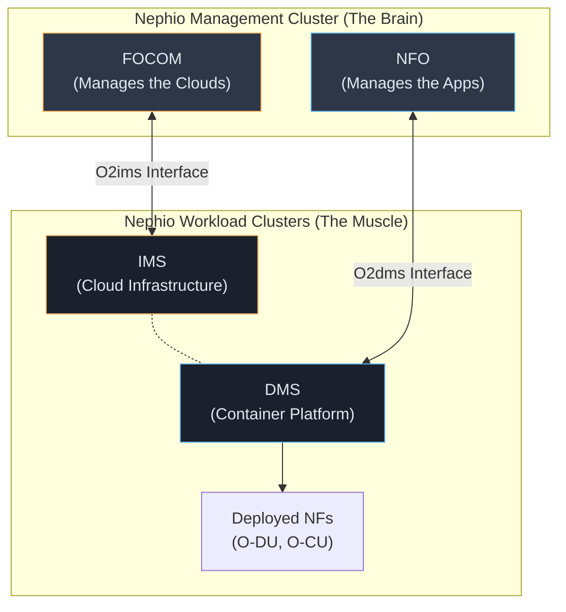
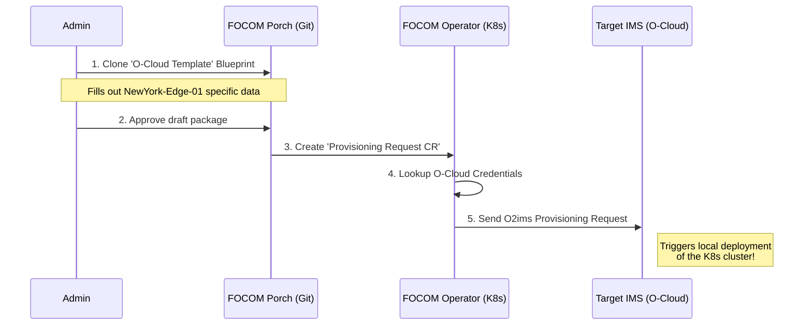

# ☁️ Nephio Study Notes — Part 4: O-RAN Integration

> **Source Material:** [Nephio Docs: O-RAN Integration](https://docs.nephio.org/docs/network-architecture/o-ran-integration/)
> **Goal:** Understand how the Nephio open-source community integrates with Open RAN (O-RAN) Alliance specifications to deploy and manage O-RAN Network Functions (NFs) under the hood.

---

## 🌍 1. The Big Picture: The O-RAN, OSC, OAI & Nephio Alliance

Deploying 5G base stations traditionally meant buying proprietary hardware. O-RAN changes this into a software problem. 

To prove this works, three communities have joined forces:
1. **OSC** (O-RAN Software Community) & **OAI** (Open Air Interface): They write the actual 5G math and radio software (the Network Functions).
2. **Nephio**: They provide the Kubernetes-native orchestration engine to actually deploy that software securely.

### The Two Domains of O-RAN Orchestration

Nephio splits O-RAN management into two perfectly logical halves:

| Domain | Abbreviation | Full Name | Nephio Engine Used | What it actually does |
|---|---|---|---|---|
| **Infrastructure Lifecycle** | **FOCOM**   **IMS** | Federated O-Cloud Orchestration & Mgmt   Infrastructure Mgmt System | **Nephio Management Cluster** | Creates and configures the physical servers / VMs (the "O-Cloud Nodes") and Kubernetes clusters. |
| **NF Deployment Lifecycle** | **NFO**   **DMS** | Network Function Orchestration   Deployment Mgmt System | **Nephio Workload Cluster** | Deploys the actual 5G software (O-DU, O-CU, xApps) onto those pre-configured K8s clusters. |

---

## 🏗️ 2. Infrastructure Management (FOCOM & IMS)

Before we deploy 5G software, we need computers to run it on. FOCOM manages this globally, while IMS manages a specific data center. 

The primary interface they use to talk to each other is **O2ims**.

### The "O-Cloud Template" Concept
O-RAN servers aren't just generic web servers. A 5G O-DU requires specific hardware configurations (BIOS settings, HugePages, SR-IOV NICs).

To handle this, Nephio uses **O-Cloud Templates**.
1. Software vendors (like Ericsson or Nokia) create an O-Cloud Template detailing the strict hardware demands of their software.
2. The SMO (FOCOM) reads this template and scans the inventory (IMS) to find a server that legally matches those demands.
3. This creates a brilliant abstraction: The SMO doesn't need to know the exact hardware vendor, it just matches the *requirements blueprint* against the *available capacity*.

---

## ⚙️ 3. Nephio Release 4 (R4) Specific Implementation

How does Nephio *actually* do this under the hood in R4? By treating infrastructure entirely as Git packages!

### The FOCOM Side (The Source of Truth)
- In FOCOM, every **O-Cloud Template** is actually just a **Kpt Package Blueprint** stored in a Git repository.
- When you want to create a new cluster, Nephio's **Porch** engine clones that exact blueprint into a brand new *draft package*.
- The user fills out the instance-specific data (like "Cluster Name: NewYork-Edge-01").
- Once approved, this triggers the **FOCOM O2ims Operator** in K8s.

### The IMS Side (The Execution)
- The FOCOM Operator sends an `O2ims Provisioning Request` down to the target data center.
- The target data center's IMS is also running Nephio enablers. 
- It catches this request via the Kubernetes API, reads the template reference (usually `nephio-workload-cluster`), and triggers Porch locally to actually spin up the worker nodes!

---

## 🚀 4. NF Deployment Management (NFO & DMS)

Once the computers (Infrastructure) exist, we deploy the software (NFs). 

The NFO (Network Function Orchestrator) handles the lifecycle of the 5G application itself across the network. It communicates with the specific edge cluster's DMS (Deployment Management System) via the **O2dms** interface using the Kubernetes profile.

### Workflow Example: `Deploy O-RAN NF`
1. The **NFO** determines an `O-DU` software component is needed in the NewYork-Edge-01 cluster.
2. The NFO generates the exact Kubernetes deployment files (Helm/Kpt).
3. The NFO pushes this down over the `O2dms` tunnel to the Workload Cluster's **DMS**.
4. The DMS creates the Pods, ensures they run, and reports back the health status.

> 🎓 **Summary:** **FOCOM/IMS** buys the plot of land and pours the concrete foundation. **NFO/DMS** builds the actual house on top of it. Both are powered entirely by Nephio's GitOps engine under the hood.
