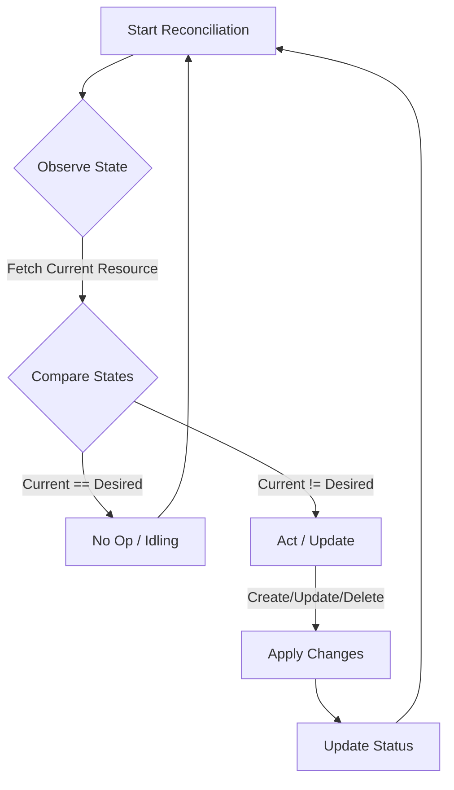
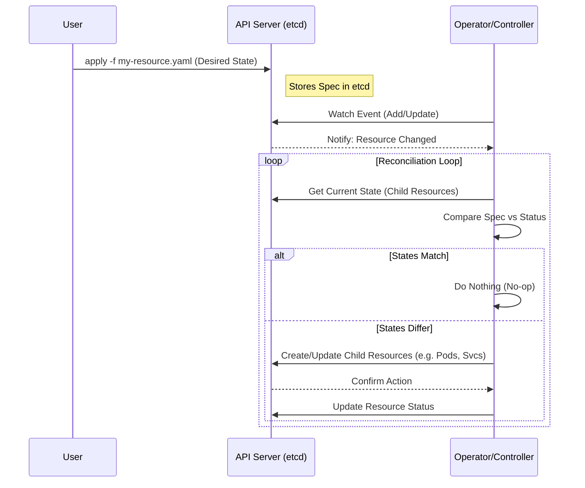

# Kubernetes Operators: specific detailed notes

## 1. Core Concept: The Control Loop
Operators are essentially custom controllers that extend Kubernetes functionalities. They rely on the fundamental **Control Loop** mechanism also known as the **Reconciliation Loop**.

### The Logic
The controller runs a continuous loop (often called `Reconcile` in code) that constantly:
1.  **Observes** the current state of the cluster.
2.  **Compares** it against the desired state (defined in your Custom Resource).
3.  **Acts** to bring the current state closer to the desired state.

### Reasoning
This mechanism ensures **Self-Healing**. By constantly comparing states, the system can automatically recover from failures (e.g., a deleted pod is recreated) without human intervention.

---

## 2. Key Principles

### Idempotency
*   **Definition**: Performing the same operation multiple times should produce the same result as performing it once.
*   **Reasoning**: In a distributed system like Kubernetes, network errors or controller restarts might cause the same event to be processed multiple times. If your operator isn't idempotent, it might create duplicate resources (e.g., 5 databases instead of 1) or cause inconsistent states.
*   **Rule**: Always check if a resource exists before creating it. If it exists, check if it needs updating.

### Statelessness
*   **Definition**: The operator primarily relies on the state stored in the Kubernetes API Server (etcd), not typically in its own memory.
*   **Reasoning**: If the operator crashes and restarts, it should be able to pick up exactly where it left off by reading the object state from the API server. It shouldn't lose context.

---

## 3. The Operator Pattern Components
An Operator is composed of three main parts:

1.  **Custom Resource Definition (CRD)**: The "Schema" or "API". It defines *what* the user can ask for (e.g., `MyDatabase` with fields `version` and `storageSize`).
2.  **Controller**: The "Brain". It watches for changes to the CRD and standard resources.
3.  **Business Logic**: The "Knowledge". The code that knows *how* to deploy and manage the application (e.g., knowing how to upgrade a database safely).

---

## 4. Kubernetes Design Philosophy
Kubernetes is designed with these pillars which Operators leverage:

1.  **Extensibility**:
    *   **Custom Resources**: Infinite API extension capabilities.
    *   **Operators**: Encapsulate operational knowledge as code.
    *   **Controllers**: The machinery that drives state transitions.

2.  **API First**:
    *   Everything is an API object.
    *   Consistent API structure allowing standard tools (`kubectl`, client libraries) to work with custom resources seamlessly.
    *   Strong backward compatibility guarantees.

3.  **Plugin-Universe**:
    *   Modular architecture for Networking (CNI), Storage (CSI), Runtime (CRI), and Webhooks.

4.  **Standardization**:
    *   Common abstractions (Pod, Service, Deployment).
    *   Unified Service Discovery and Config Management.

---

## 5. Detailed Reconciliation Flow

### Explanation of the Flow
1.  **User Declares State**: The user submits a YAML manifest defining the *desired* state.
2.  **API Server Persists**: The API server validates and stores this in `etcd`.
3.  **Controller Notified**: The operator lists/watches for this resource type and gets triggered.
4.  **Reconcile**: The logic runs—detecting that the "Database" resource exists but the underlying "StatefulSet" does not.
5.  **Action**: The operator creates the StatefulSet.
6.  **Status Update**: The operator updates the statuses (e.g., `State: Creating`).