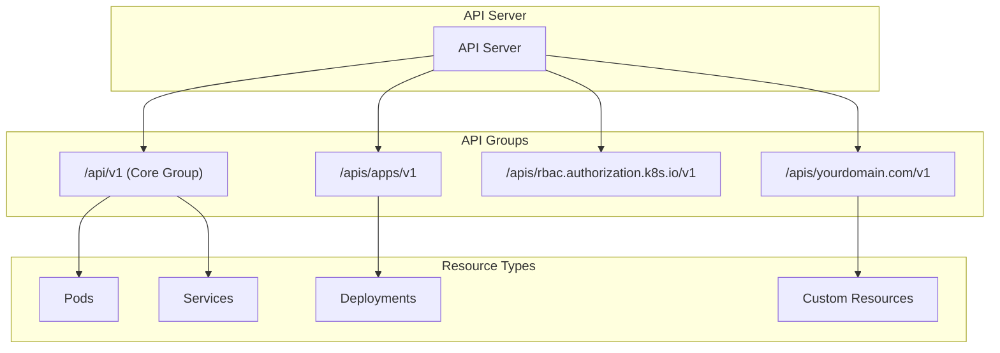
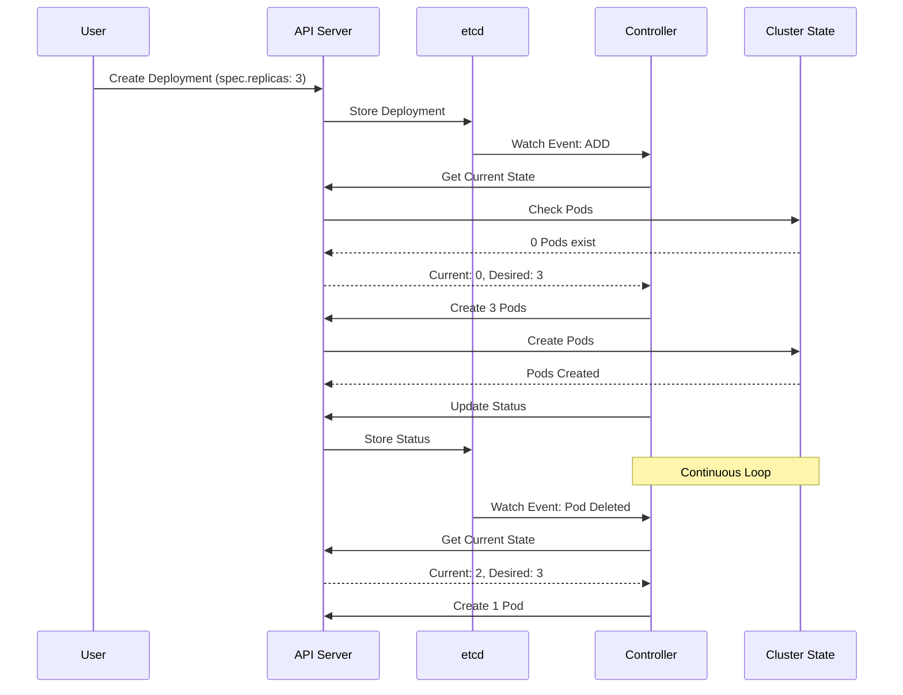
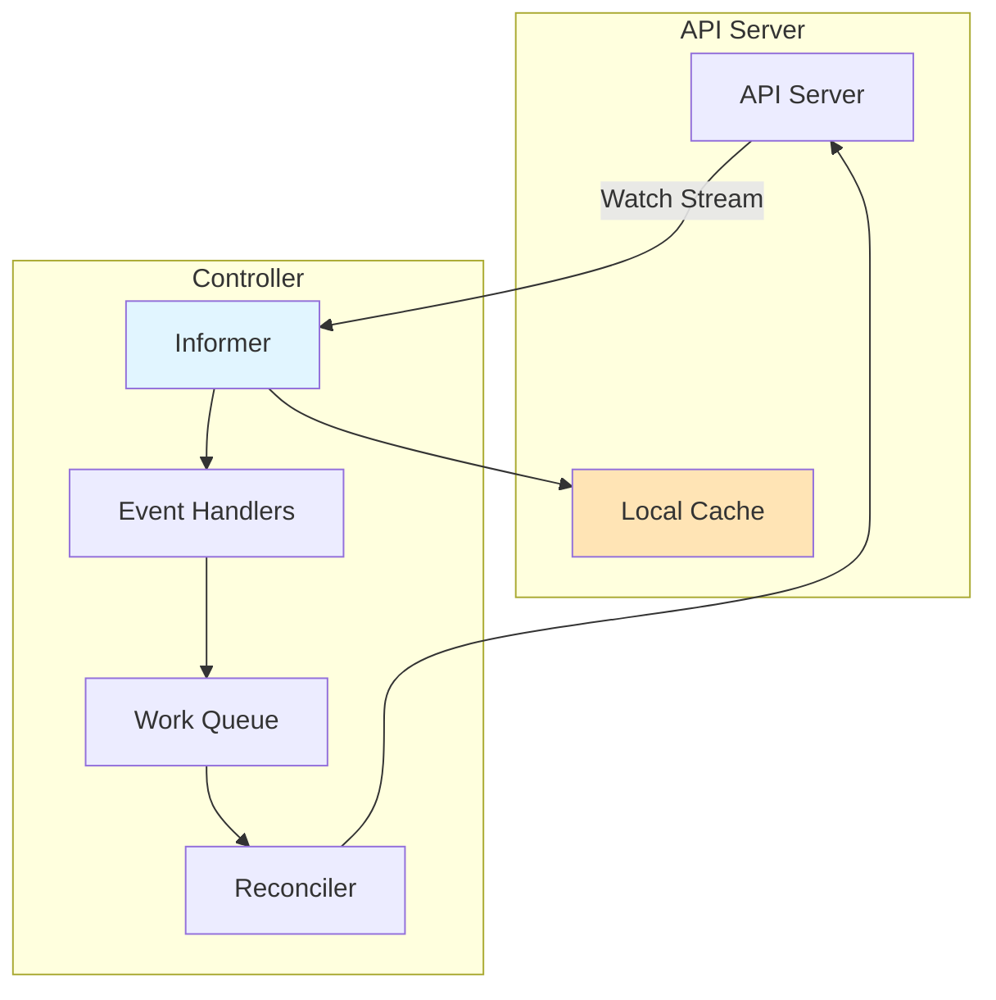
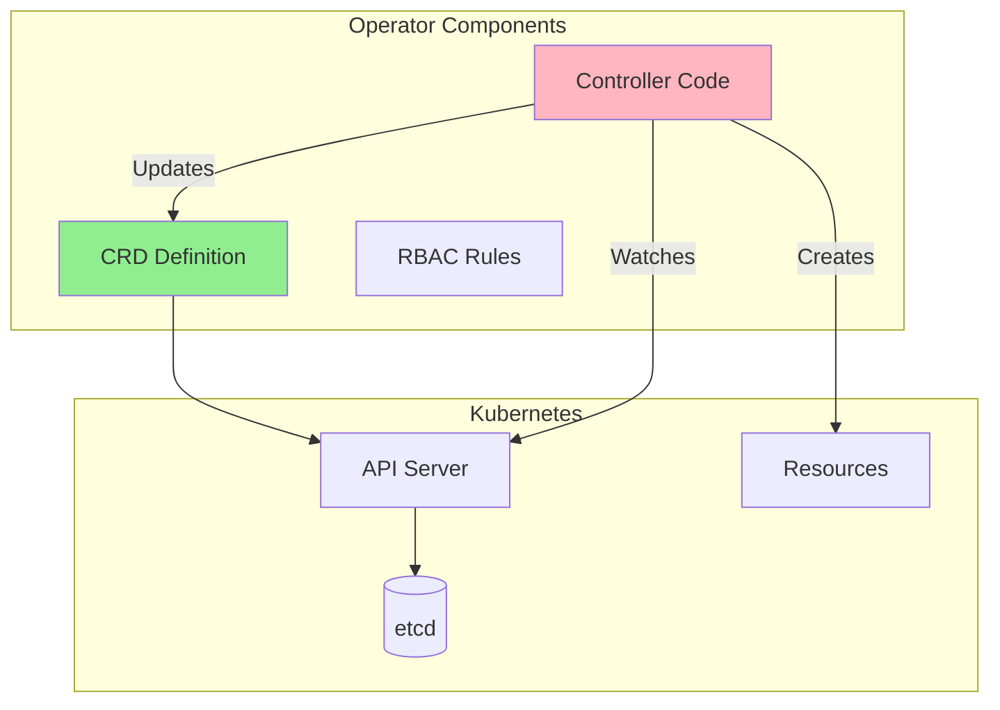

nerdctl ps
nerdctl build .
nerdctl pull nginx
nerdctl run nginx

server is master
agents is workers

Virtualization (The "Matrix")

Your Laptop (The Host):
You have, say, 1 physical CPU with 8 cores and 16GB of RAM.

The Slice (The VM/WSL):
Rancher Desktop creates a Virtual Machine (VM) (running Linux) on Windows. It carves out a slice of your laptop—say, 2 CPUs and 4GB RAM—and dedicates it to this Linux world.

The Illusion (Containers as Nodes):
Inside that Linux slice, the tool you used (k3d) pulls a magic trick. It starts 3 Docker Containers.

Container 1: Pretends to be the "Master Node".

Container 2: Pretends to be "Worker Node A".

Container 3: Pretends to be "Worker Node B".

To your laptop: It just sees 3 heavy programs running. It divides its processing power between them.
To Kubernetes: It sees 3 completely separate "computers" networked together.

. The "All-in-One" (Local / Dev)
What you have now (Rancher Desktop / Minikube).

Setup: The Master and the Worker are the same computer (or virtual machine).

Use Case: Testing, learning, coding on your laptop.

Risk: If your laptop dies, the whole cluster dies.

B. The "Standard" (Production)
Setup: distinct physical (or virtual) machines.

3 computers are only Masters (for safety).

5+ computers are only Workers.

Use Case: Running real companies (Netflix, Uber, etc.).

Why: If a Worker computer catches fire, the Masters notice and move the work to the other 4 Workers. The app never goes down.

C. The "Managed" (Cloud)
Examples: EKS (AWS), AKS (Azure), GKE (Google).

Setup: You don't even see the Master nodes. The cloud provider manages the "Brain" for you completely. You only pay for the "Worker" computers that run your specific apps.

k3d cluster list
k3d cluster start clusterName
k3d cluster delete clusterName
k3d cluster create --config cluster.yaml

kubectl cluster-info
docker ps

kubectl create deployment mydeployment --image=docker.io/nginx:alpine
kubectl expose deployment mydeployment --port 80
k run curl --image=curlimages/curl:8.15.0 -- -L -v http://10.43.104.57

KubeBuilder:
kubebuilder init --domain samsung.com --repo github.com/samsung/ec2-operator
main.go -> Entry point of the operator

API Server is the central communication hub
etcd stores all cluster state
Controller Manager runs built-in controllers that implement core functionality
Scheduler assigns Pods to nodes
All components communicate through the API Server
Controllers watch resources and reconcile desired vs actual state

API Groups: Organizes Related Resources
API Versions: Support multiple version of same resource
Subresources: status,scale, exec(extend resource behaviour)
Watch: long lived connections for change notifications
Field Selectors: filter resources by field values

Resources Structure:
apiVersion: API Group and Version
kind: Resource Type
metadata: Identity and Labels
spec: Desired State
status: Actual State

kubectl api-resources
kubectl api-versions

Every resource has a resourceVersion that changes on update

The Controller Pattern:

Controllers uses watches to be notified of changes:

Use ConfigMaps when:

Simple key-value data
No validation needed
No API semantics required
Use CRDs when:

Structured data with schema
Validation required
API semantics needed
Building an operator

Operator Pattern:
Operational Knowledge as code
Self Service Autiomation

Operator Capability Levels
The Operator Capability Model (Level 1-5) helps understand operator sophistication:

Level 1-2: Basic deployment and upgrades
Level 3: Full lifecycle management
Level 4-5: Advanced automation and self-healing

Use Operators when:
1. Continouse Management
2. Application has complex lifestyle(backup,restore, scaling, DR)
3. Stateful Applications(Database and Message Queue)
4. Domain Specific Knowledge required
5. Want declaritive management of operational tasks

eg:
Prometheus Operator
Manages Prometheus monitoring stack:
Deploys Prometheus servers
Configures service discovery
Manages alerting rules
Handles storage

PostgreSQL Operator
Manages PostgreSQL databases:
Creates database clusters
Handles backups
Manages replication
Performs upgrades

Elasticsearch Operator
Manages Elasticsearch clusters:
Deploys cluster nodes
Manages sharding
Handles scaling
Manages indices

