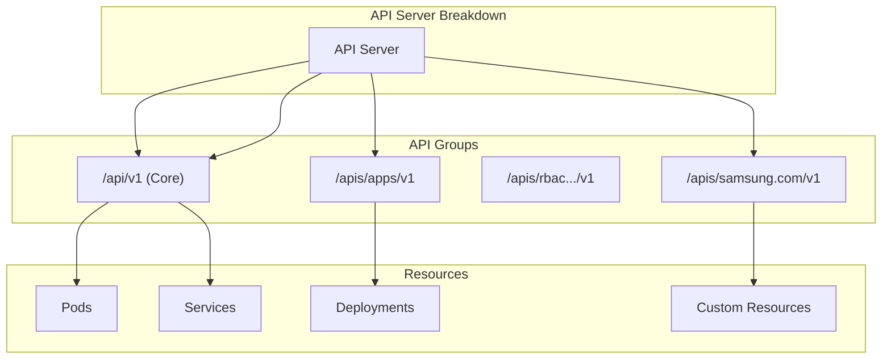
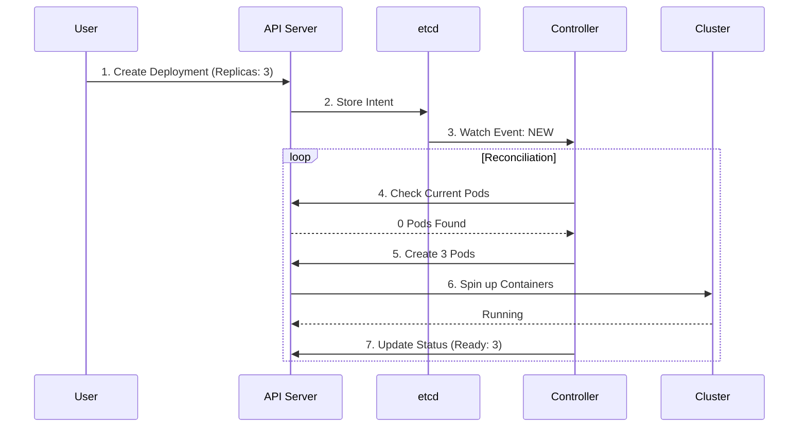
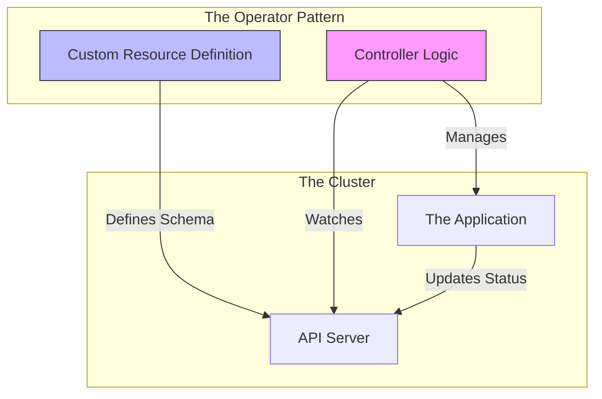

# Kubernetes & Operators: Field Notes

## 1. The Environment: Virtualization & Clusters

### Concept: The "Matrix" of Virtualization
Understanding how your local Kubernetes cluster (like k3d) runs on your laptop.

1.  **Your Laptop (The Host)**: The physical hardware (e.g., 1 CPU, 8 Cores, 16GB RAM).
2.  **The Slice (VM/WSL)**: Tools like Rancher Desktop or Docker Desktop create a Linux Virtual Machine. It takes a "slice" of your hardware (e.g., 2 CPUs, 4GB RAM) to run containers.
3.  **The Illusion (Containers as Nodes)**:
    *   **k3d** creates 3 Docker Containers inside that VM.
    *   **Container 1** acts as the **Master Node**.
    *   **Container 2 & 3** act as **Worker Nodes**.
    *   *Result*: To Kubernetes, it looks like 3 physical computers connected by wires. To your laptop, it's just 3 programs running.

### Cluster Types

| Type | Description | Use Case |
| :--- | :--- | :--- |
| **Local (All-in-One)** | Master & Worker are the same machine (Minikube). | Coding, Learning. **Risk**: Laptop dies = Cluster dies. |
| **Standard (Production)** | Distinct machines. 3 Masters (Safety) + N Workers. | Running Apps (Netflix, Uber). **Benefit**: If a worker fails, apps move. |
| **Managed (Cloud)** | EKS, AKS, GKE. Cloud manages Masters. | You only pay for Workers. "Brain" is managed by AWS/Google. |

### Essential Commands
```bash
# Container Management (nerdctl/docker)
nerdctl ps              # List running containers
nerdctl build .         # Build an image
nerdctl pull nginx      # Download an image

# k3d (Local Cluster)
k3d cluster create --config cluster.yaml
k3d cluster list
k3d cluster delete mycluster

# kubectl (The Remote Control)
kubectl cluster-info
kubectl run curl --image=curlimages/curl ... # Run a quick pod
kubectl create deployment mydep --image=nginx
```

---

## 2. Kubernetes Architecture

### The Core Components
1.  **API Server**: The **Hub**. All components (Scheduler, Controllers, You) talk ONLY to the API Server.
2.  **etcd**: The **Brain**. Stores the entire state of the cluster.
3.  **Controller Manager**: Runs core loops (Node Controller, ReplicaSet Controller).
4.  **Scheduler**: Decides *where* to put a new Pod.

### Resource Structure
Every Kubernetes object follows this shape:

```yaml
apiVersion: apps/v1        # Group & Version
kind: Deployment           # Type
metadata:                  # Identity
  name: my-app
spec:                      # Desired State (What you want)
  replicas: 3
status:                    # Actual State (What is real)
  readyReplicas: 1         # (Updated by Controller)
```



---

## 3. The Controller Pattern

### The Logic Loop
Controllers are the workers that make the `spec` become `status`.

1.  **Watch**: Long-lived connection to API Server. "Tell me if a Pod changes."
2.  **Reconcile**:
    *   **Get** Current State.
    *   **Compare** with Desired State.
    *   **Act** (Create/Delete) to match.



---

## 4. Operators

**Definition**: An Operator is "Operational Knowledge encoded as Software". It replaces the human sysadmin.

### When to use them?
*   **ConfigMaps**: Use for simple key-value data (Env vars).
*   **CRDs/Operators**: Use when you need **Structured Data** + **Logic** (Backups, Scaling, Upgrades).

### Capability Levels
1.  **Basic Install**: Just deploys the app.
2.  **Seamless Upgrades**: Handles version updates.
3.  **Full Lifecycle**: Backups, Restore.
4.  **Deep Insights**: Metrics, Alerts.
5.  **Auto Pilot**: Auto-scaling, Self-healing.

### Examples
*   **Prometheus Operator**: Manages config reloading, rule files.
*   **Postgres Operator**: Handles master-slave replication and failover.


