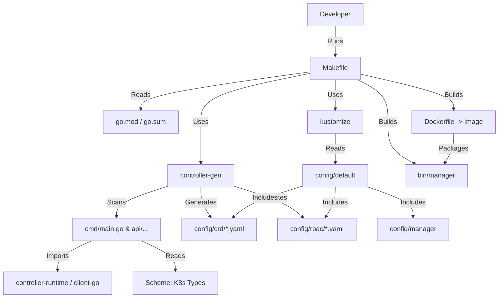

# Deep Dive: Anatomy of a KubeBuilder Project

This document provides a comprehensive, line-by-line, file-by-file explanation of the `ec2-operator` project.

## 1. The Web of Connections
How do all these files relate to each other?



---

## 2. Top-Level Project Structure

| File / Folder | Purpose & Details |
| :--- | :--- |
| **`cmd/`** | Contains the **entry point**. `cmd/main.go` is the "Bootloader" that starts the Manager. |
| **`config/`** | **Deployment Configuration**. Contains YAML manifests patched by Kustomize. |
| **`hack/`** | **Scripts**. Helper scripts for development tasks. |
| **`test/`** | **Tests**. Contains End-to-End (e2e) tests to verify the operator in a real cluster. |
| **`Makefile`** | **Automation**. The control center for building, testing, and deploying. |
| **`.golangci.yml`** | **Linting**. Configuration for code style and quality checks. |
| **`go.mod`** | **Dependencies**. Defines imports and versions. |
| **`go.sum`** | **Checksums**. Locks dependencies to exact hashes for security/reproducibility. |
| **`PROJECT`** | **Metadata**. Stores project config for the `kubebuilder` tool itself. |

---

## 3. Libraries (The "Holy Trinity")

### A. `k8s.io/apimachinery` (Data Model)
Defines *what* data looks like (GVK, JSON structs).

### B. `k8s.io/client-go` (Messenger)
Defines *how* to talk to the API Server (Auth, REST Client).

### C. `sigs.k8s.io/controller-runtime` (Framework)
**The Manager**: Manages shared Cache and Clients.
**The Reconciler**: The loop `Current vs Desired`.

---

## 4. Deep Dive: `cmd/main.go`

### Imports & Side-Effects
```go
import (
    ...
    _ "k8s.io/client-go/plugin/pkg/client/auth" 
)
```
*   **Significance**: The `_` means "import for side-effects only". This registers auth plugins (like GCP, Azure, OIDC) so your local client can authenticate with cloud clusters.

### Scheme Registration
```go
scheme = runtime.NewScheme()
init() { utilruntime.Must(clientgoscheme.AddToScheme(scheme)) }
```
*   **Significance**: Tells the operator how to map Go Structs (`v1.Pod`) to K8s Kinds (`kind: Pod`). Without this, the operator is blind.

### Manager Options
```go
mgr, err := ctrl.NewManager(ctrl.GetConfigOrDie(), ctrl.Options{
    Metrics: metricsserver.Options{BindAddress: metricsAddr},
    LeaderElection: enableLeaderElection,
    ...
})
```
*   **`GetConfigOrDie`**: Automatically finds kubeconfig (Local `~/.kube/config` or Cluster `/var/run/secrets/...`).
*   **`LeaderElection`**: Ensures only **one** replica runs the logic if you deploy multiple replicas for HA.
*   **`Metrics`**: Exposes internal stats on port `:8080` for Prometheus.

---

## 5. File-by-File Explanations

### `Makefile`
The Command Center.
*   **`make manifests`**: Runs `controller-gen` to generate CRD YAMLs from Go structs.
*   **`make generate`**: Generates deep-copy methods (required for K8s objects).
*   **`make docker-build`**: Builds the container image.
*   **`make install`**: Installs CRDs to your cluster.

### `go.mod` vs `go.sum`
*   **`go.mod`**: The Manifest. "I need `controller-runtime` version `v0.15.0`".
*   **`go.sum`**: The Lockfile. "The file `controller-runtime-v0.15.0.zip` usually has hash `h1:xyz...`". This ensures nobody tampered with the library on the internet.

### `.golangci.yml`
Configuration for `golangci-lint`.
*   **Rules**: It enforces strict rules.
    *   `gocyclo`: "This function is too complex (too many if/else)".
    *   `lll`: "Line too long".
    *   `govet`: Standard Go analysis.
*   **Why?**: Operators are complex. Strict linting prevents bugs before they happen.

### `test/`
*   **`test/e2e`**: End-to-End tests.
*   **What they do**: They usually require a running cluster (like `Kind`). They apply the CRD, create a custom resource, and *wait* to see if the operator actually does its job (e.g., creates a Pod).

### `hack/`
*   **`boilerplate.go.txt`**: A text file containing the Apache 2.0 License header. The code generator (`controller-gen`) reads this and pastes it at the top of every generated file.

### `PROJECT`
*   **Purpose**: This is the "Save Game" file for the `kubebuilder` CLI.
*   **Content**:
    *   `domain`: `samsung.com` (Prefix for API groups).
    *   `repo`: `github.com/...` (Go module name).
*   **Usage**: When you run `kubebuilder create api`, it checks this file to know where to put the new files.

### `config/`
*   **`config/default`**: The entry point for Kustomize. It "patches" everything together.
*   **`config/rbac`**: Permissions.
    *   `role.yaml`: "I can read Pods".
    *   `role_binding.yaml`: "The account `controller-manager` has the `role`".
*   **`config/manager`**:
    *   `manager.yaml`: The Deployment that runs the binary. It usually requests resources (cpu/memory) and sets the image name.
