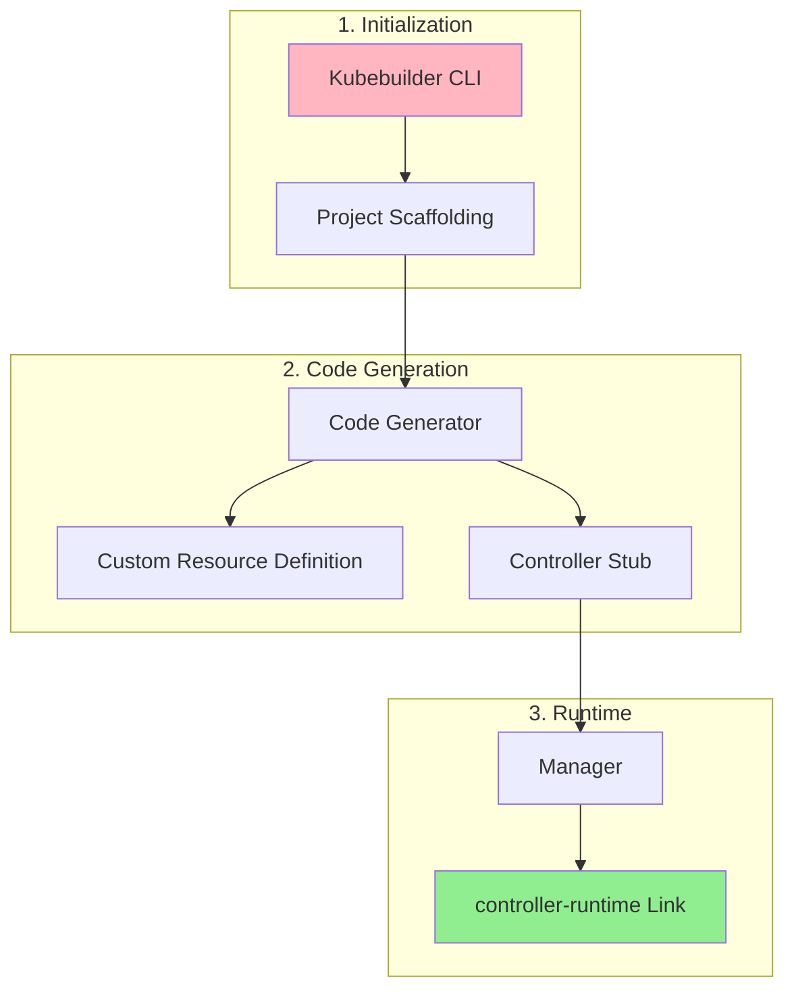
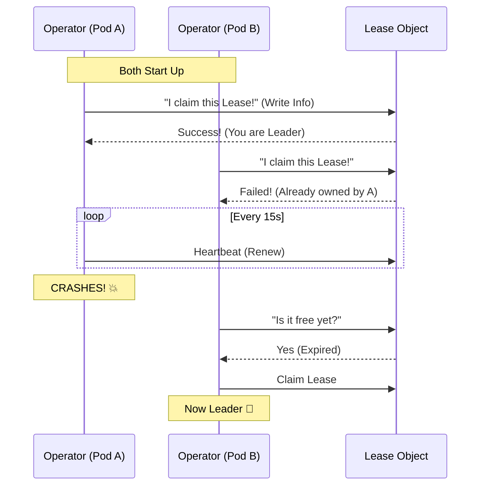
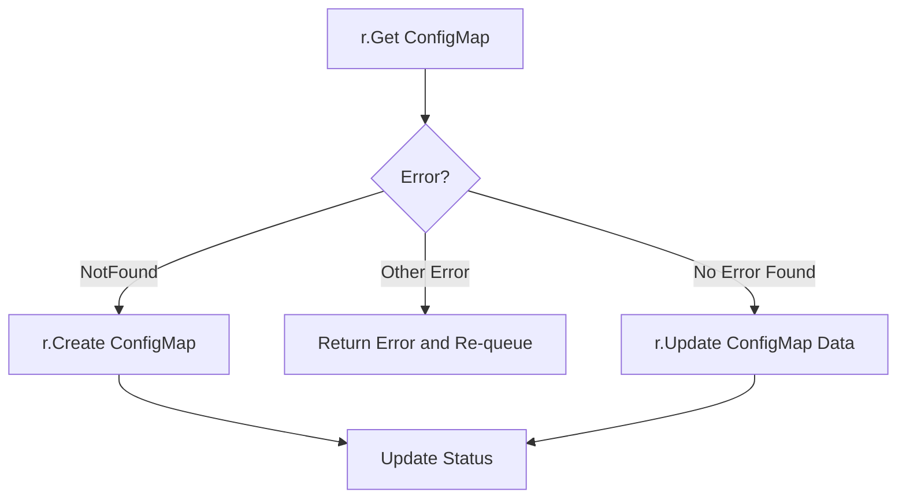
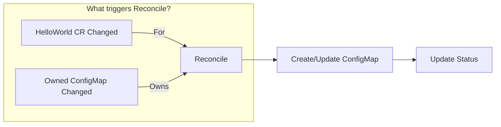

# Kubebuilder & Controller Logic: Deep Dive

## 1. The Kubebuilder Workflow
Kubebuilder is a framework that scaffolds your operator. It's strictly Go-based and follows native K8s patterns.

### The Scaffolding Process


### Essential Commands
1.  **`kubebuilder init`**: Sets up the project structure (go.mod, Makefile, cmd/main.go).
2.  **`kubebuilder create api`**: Creates the `api/` (Structs) and `internal/` (Controller) folders.
3.  **`make generate`**: The magic command. It reads your Go structs and generates:
    *   **DeepCopy methods** (`zz_generated.deepcopy.go`).
    *   **CRD Manifests** (`config/crd/...`).
4.  **`make manifests`**: Updates RBAC roles and CRD YAMLs based on markers.

---

## 2. Core Concepts: Controller Runtime
The `controller-runtime` library provides the heavy lifting.

*   **Manager**: The "Brain". Coordinates all controllers, webhooks, and the cache.
*   **Cache**: A local copy of the cluster state. *Why?* To avoid hammering the API server with thousands of requests.
*   **Client**: Reads from the local **Cache** (Fast) but writes to the **API Server** (Safe).
*   **Reconciler**: Your logic. It takes a name (`namespace/name`) and ensures the world matches your `Spec`.

### Markers (Annotations)
Comments that start with `// +kubebuilder` are instructions for the code generator.
*   `// +kubebuilder:object:root=true`: "This struct is a Top-Level K8s object (like Pod/Deployment)." -> Generates DeepCopyObject().
*   `// +kubebuilder:subresource:status`: "Enable the `/status` subresource." -> Allows updating status without re-triggering the spec reconciliation.
*   `// +kubebuilder:validation:Minimum=1`: "Enforce this rule in the CRD YAML."

---

## 3. Advanced Mechanics

### Leader Election (The "Highlander" Rule)
In production, you run multiple replicas of your operator for safety. But you only want **ONE** to be active (The Leader).

**How it works**: They fight over a **Lease Object** (a lock file in K8s).



### DeepCopy (Why do we need it?)
Go uses **pointers**. If the Cache gives you a pointer to a Pod, and you modify it directly, you corrupt the global cache for everyone else!
*   **Solution**: **DeepCopy**. It creates a 100% independent clone of the object. You modify the clone, then send it to the API server.

---

## 4. Coding the Logic (The Reconciliation)

### The Reconciler Struct
```go
type HelloWorldReconciler struct {
    client.Client   // The client to talk to K8s
    Scheme *runtime.Scheme // The registry of K8s types
}
```

### The Logic Flow (HelloWorld Example)
Your goal: Ensure a `ConfigMap` exists that matches the `HelloWorld` spec.

```mermaid
flowchart TD
    start[Start Reconcile] --> fetch[Fetch HelloWorld CR]
    fetch -->|Not Found| stop[Stop (Deleted)]
    fetch -->|Found| checkCM[Check for ConfigMap]
    
    checkCM -->|Not Found| createCM[Create ConfigMap]
    createCM --> setOwner[Set OwnerReference]
    setOwner --> updateState[Update Status]
    
    checkCM -->|Found| compare[Compare Data]
    compare -->|Match| done[Done]
    compare -->|Mismatch| updateCM[Update ConfigMap]
    updateCM --> done
```

### Key Functions
*   **`r.Get(ctx, name, &object)`**: Fetches an object from Cache.
*   **`ctrl.SetControllerReference(owner, child, scheme)`**:
    *   **Crucial**: Sets the "Parent-Child" relationship.
    *   **Effect**: If user deletes `HelloWorld` (Parent), K8s automatically garbage-collects `ConfigMap` (Child).
*   **`Owns(&corev1.ConfigMap{})`**:
    *   Tells the Manager: "Watch ConfigMaps too! If a ConfigMap owned by me changes, trigger my Reconcile loop."

---

## 5. Full Code Walkthrough: `helloworld_controller.go`

This is the complete, annotated explanation of the HelloWorld controller.

### 5.1 The Imports

```go
package controller // This file belongs to the "controller" package

import (
    "context"   // For managing request lifecycle (timeouts, cancellation)
    "fmt"       // For string formatting (fmt.Sprintf)

    corev1 "k8s.io/api/core/v1"                      // Core K8s types (ConfigMap, Pod, Service, etc.)
    "k8s.io/apimachinery/pkg/api/errors"              // K8s error types (IsNotFound, IsAlreadyExists, etc.)
    metav1 "k8s.io/apimachinery/pkg/apis/meta/v1"     // Metadata types (ObjectMeta: Name, Namespace, Labels)
    "k8s.io/apimachinery/pkg/runtime"                 // The Scheme registry (maps Go types <-> K8s GVKs)
    ctrl "sigs.k8s.io/controller-runtime"             // The main controller-runtime framework (aliased as "ctrl")
    "sigs.k8s.io/controller-runtime/pkg/client"       // The K8s client (Get, Create, Update, Delete)
    logf "sigs.k8s.io/controller-runtime/pkg/log"     // Structured logging

    hellov1 "github.com/example/hello-world-operator/api/v1"  // YOUR custom types (HelloWorld struct)
)
```

| Import | Alias | Why? |
| :--- | :--- | :--- |
| `k8s.io/api/core/v1` | `corev1` | So you can write `corev1.ConfigMap` instead of the full path. |
| `k8s.io/apimachinery/pkg/apis/meta/v1` | `metav1` | So you can write `metav1.ObjectMeta` for setting Name/Namespace. |
| `sigs.k8s.io/controller-runtime` | `ctrl` | The core framework. `ctrl.Request`, `ctrl.Result`, `ctrl.NewManager`. |
| `sigs.k8s.io/controller-runtime/pkg/log` | `logf` | Structured logging. `logf.FromContext(ctx)` extracts the logger. |
| `your-api/v1` | `hellov1` | Your own CRD types. `hellov1.HelloWorld` is your custom resource. |

---

### 5.2 The Reconciler Struct

```go
type HelloWorldReconciler struct {
    client.Client              // Embedded: gives you r.Get(), r.Create(), r.Update(), r.Delete()
    Scheme *runtime.Scheme     // The type registry: knows how to convert Go structs <-> K8s objects
}
```

**Why embed `client.Client`?**
Go embedding means `HelloWorldReconciler` *inherits* all the methods of `client.Client`. Instead of writing `r.Client.Get(...)`, you can just write `r.Get(...)`.

**What is `Scheme`?**
It's a lookup table. When you call `r.Create(ctx, configMap)`, the Scheme translates the Go struct `corev1.ConfigMap` into the correct K8s API call (`POST /api/v1/namespaces/.../configmaps`).

---

### 5.3 RBAC Markers

```go
// +kubebuilder:rbac:groups=hello.example.com,resources=helloworlds,verbs=get;list;watch;create;update;patch;delete
// +kubebuilder:rbac:groups=hello.example.com,resources=helloworlds/status,verbs=get;update;patch
// +kubebuilder:rbac:groups=hello.example.com,resources=helloworlds/finalizers,verbs=update
// +kubebuilder:rbac:groups=core,resources=configmaps,verbs=get;list;watch;create;update;patch;delete
```

These are **NOT regular comments**. They are instructions for `controller-gen`. When you run `make manifests`, it reads these and generates RBAC ClusterRole YAML files.

| Marker | Meaning |
| :--- | :--- |
| `groups=hello.example.com` | The API group of *your* CRD. |
| `resources=helloworlds` | The plural name of your resource. |
| `verbs=get;list;watch;...` | What this controller is **allowed** to do. |
| `resources=helloworlds/status` | Permission to update the `/status` subresource separately. |
| `groups=core,resources=configmaps` | Permission to manage **built-in** ConfigMaps (core group = `""`). |

---

### 5.4 The Reconcile Function (Line by Line)

This is the heart of the operator. K8s calls this function every time something changes.

#### Function Signature
```go
func (r *HelloWorldReconciler) Reconcile(ctx context.Context, req ctrl.Request) (ctrl.Result, error)
```

| Argument | Type | What it is |
| :--- | :--- | :--- |
| `r` | `*HelloWorldReconciler` | The receiver. `r.Get()`, `r.Create()` are available through it. |
| `ctx` | `context.Context` | Carries **timeouts**, **cancellation signals**, and **log metadata**. Passed to every K8s API call. |
| `req` | `ctrl.Request` | Contains **only** `req.NamespacedName` (e.g., `default/my-hello`). It does NOT contain the object itself. |

| Return | What it means |
| :--- | :--- |
| `ctrl.Result{}` | "I'm done. Don't re-queue." |
| `ctrl.Result{Requeue: true}` | "Run me again soon." |
| `ctrl.Result{RequeueAfter: 5*time.Minute}` | "Run me again in 5 minutes." |
| `error` (non-nil) | "Something went wrong. Re-queue me with backoff." |

#### Step 1: Get the Logger
```go
log := logf.FromContext(ctx)
```
Extracts a structured logger from the context. It already knows the object's name/namespace.

#### Step 2: Fetch the HelloWorld CR
```go
helloWorld := &hellov1.HelloWorld{}
if err := r.Get(ctx, req.NamespacedName, helloWorld); err != nil {
    if errors.IsNotFound(err) {
        return ctrl.Result{}, nil   // Object was deleted. Nothing to do.
    }
    return ctrl.Result{}, err       // Real error (network, permissions). Re-queue.
}
```

| Part | Explanation |
| :--- | :--- |
| `&hellov1.HelloWorld{}` | Create an empty HelloWorld struct. `r.Get` will fill it with data from the cache. |
| `req.NamespacedName` | The `namespace/name` key (e.g., `"default/my-hello"`). |
| `errors.IsNotFound(err)` | If the CR was deleted between the event and reconciliation, just stop gracefully. |

#### Step 3: Build the Desired ConfigMap
```go
configMap := &corev1.ConfigMap{
    ObjectMeta: metav1.ObjectMeta{
        Name:      helloWorld.Name + "-config",   // e.g., "my-hello-config"
        Namespace: helloWorld.Namespace,           // Same namespace as the CR
    },
    Data: map[string]string{
        "message": helloWorld.Spec.Message,                   // From spec
        "count":   fmt.Sprintf("%d", helloWorld.Spec.Count),  // Convert int to string
    },
}
```
This is the **Desired State**. We build what the ConfigMap *should* look like based on the CR's spec.

#### Step 4: Set Owner Reference
```go
if err := ctrl.SetControllerReference(helloWorld, configMap, r.Scheme); err != nil {
    return ctrl.Result{}, err
}
```

| Argument | What it is |
| :--- | :--- |
| `helloWorld` | The **Owner** (Parent). |
| `configMap` | The **Owned** (Child). |
| `r.Scheme` | Needed to look up the GVK (Group/Version/Kind) of the owner. |

**Effect**: The ConfigMap's metadata will now contain:
```yaml
ownerReferences:
  - apiVersion: hello.example.com/v1
    kind: HelloWorld
    name: my-hello
    controller: true
```
If the HelloWorld CR is deleted → K8s garbage collector automatically deletes the ConfigMap.

#### Step 5: Check if ConfigMap Already Exists
```go
existingConfigMap := &corev1.ConfigMap{}
err := r.Get(ctx, client.ObjectKey{
    Name:      configMap.Name,
    Namespace: configMap.Namespace,
}, existingConfigMap)
```
`client.ObjectKey` is the same as `types.NamespacedName`. It's just `{Name, Namespace}`.

#### Step 6: The Three-Way Branch
```go
if err != nil && errors.IsNotFound(err) {
    // CASE 1: ConfigMap doesn't exist → CREATE it
    log.Info("Creating ConfigMap", "name", configMap.Name)
    if err := r.Create(ctx, configMap); err != nil {
        return ctrl.Result{}, err
    }
} else if err != nil {
    // CASE 2: Something went wrong → RETURN error (will be re-queued)
    return ctrl.Result{}, err
} else {
    // CASE 3: ConfigMap exists → UPDATE its data
    log.Info("Updating ConfigMap", "name", configMap.Name)
    existingConfigMap.Data = configMap.Data
    if err := r.Update(ctx, existingConfigMap); err != nil {
        return ctrl.Result{}, err
    }
}
```



#### Step 7: Update Status
```go
helloWorld.Status.Phase = "Ready"
helloWorld.Status.ConfigMapCreated = true
if err := r.Status().Update(ctx, helloWorld); err != nil {
    return ctrl.Result{}, err
}
```
**Why `r.Status().Update()` instead of `r.Update()`?**
Because of the `// +kubebuilder:subresource:status` marker, the status is a **separate subresource**. Updating it via `r.Status().Update()` does NOT trigger a new reconciliation of the spec. Using `r.Update()` would update the whole object and could cause an infinite loop.

---

### 5.5 SetupWithManager (Wiring it all together)

```go
func (r *HelloWorldReconciler) SetupWithManager(mgr ctrl.Manager) error {
    return ctrl.NewControllerManagedBy(mgr).  // "Create a new controller under this Manager"
        For(&hellov1.HelloWorld{}).            // "Watch HelloWorld objects (primary resource)"
        Owns(&corev1.ConfigMap{}).             // "Also watch ConfigMaps owned by HelloWorld"
        Named("helloworld").                  // "Name this controller 'helloworld'"
        Complete(r)                           // "Use 'r' (HelloWorldReconciler) as the Reconciler"
}
```

| Method | Purpose |
| :--- | :--- |
| `For(&hellov1.HelloWorld{})` | **Primary Watch**. Any Create/Update/Delete on a HelloWorld triggers Reconcile. |
| `Owns(&corev1.ConfigMap{})` | **Secondary Watch**. If someone externally deletes the ConfigMap, the controller notices and re-creates it. |
| `Named("helloworld")` | Sets the controller name (used in logs and metrics). |
| `Complete(r)` | Finishes setup and registers the reconciler. |

