# 📘 Operator Notes — Notes 5: Controller-Runtime Deep Dive

> **Goal:** Understand the inner workings of `controller-runtime`, how the Manager and Reconciler interact, dependency handling, KubeBuilder validations, and the mechanics of Client-Go (Informers, Watches, and Patching).

---

## 1. Controller-Runtime Core Components

`controller-runtime` is the foundation of KubeBuilder. It provides high-level abstractions over the low-level `client-go` library, making it easier to build robust Operators.

```mermaid
graph TB
    subgraph "⚙️ Controller-Runtime"
        MGR["👔 Manager<br/>(The Boss)"]
        REC["🛠️ Reconciler(s)<br/>(The Workers)"]
        CLIENT["🔌 Client<br/>(The Bridge)"]
        CACHE["💾 Local Cache<br/>(Informer-based)"]
    end

    API["☸️ Kubernetes API Server"]

    MGR -->|"creates & runs"| REC
    MGR -->|"provides"| CLIENT
    MGR -->|"maintains"| CACHE
    
    REC -->|"reads from"| CACHE
    REC -->|"writes to"| API
    CACHE -->|"watches for updates"| API

    style MGR fill:#2d3748,stroke:#f6ad55,color:#e2e8f0
    style REC fill:#2d3748,stroke:#63b3ed,color:#e2e8f0
    style CLIENT fill:#2d3748,stroke:#63b3ed,color:#e2e8f0
    style CACHE fill:#2d3748,stroke:#9f7aea,color:#e2e8f0
    style API fill:#1a202c,stroke:#68d391,color:#e2e8f0
```



### 👔 The Manager

The Manager is the entry point of your operator. It coordinates everything.

| Responsibility | Description |
|---|---|
| **Manages Controllers** | Registers and runs all your reconcilers. |
| **Manages Cache** | Maintains the local informer-based cache of resources. |
| **Manages Client** | Provides the `client.Client` interface for read/write access. |
| **Manages Scheme** | Handles API type registration (knowing what a `StatefulSet` vs `MyCustomCRD` is). |
| **Leader Election** | Ensures only *one* instance of your operator is actively reconciling at a time (High Availability). |

### 🛠️ The Reconciler

The typical setup in `main.go`:

```go
func main() {
    // 1. Create the Manager
    mgr, err := ctrl.NewManager(ctrl.GetConfigOrDie(), ctrl.Options{
        Scheme:                 scheme,
        MetricsBindAddress:     metricsAddr,
        Port:                   9443,
        HealthProbeBindAddress: probeAddr,
        LeaderElection:         enableLeaderElection,
    })
    
    // 2. Setup the Reconciler with the Manager
    if err := (&controllers.MyReconciler{
        Client: mgr.GetClient(),
        Scheme: mgr.GetScheme(),
    }).SetupWithManager(mgr); err != nil {
        // Handle error
    }
    
    // 3. Start the Manager (blocks forever)
    mgr.Start(ctrl.SetupSignalHandler())
}
```

---

## 2. The Reconciliation Loop

The core function of your operator is the `Reconcile` method:

```go
func (r *MyReconciler) Reconcile(ctx context.Context, req ctrl.Request) (ctrl.Result, error)
```

- **`ctx`**: Context used for cancellation and timeouts.
- **`req`**: Contains *only* the **Namespace** and **Name** of the object that triggered the event (the actual object data is NOT passed, you must fetch it).

### Return Values: `ctrl.Result`

Your reconciler tells the Manager what to do next by returning a `ctrl.Result`.

| Return Value | Meaning | When to use |
|---|---|---|
| `return ctrl.Result{}, nil` | **Success.** Reconcile complete. | The current state matches desired state. No further action needed until the next event. |
| `return ctrl.Result{Requeue: true}, nil` | **Retry Immediately.** Run again right now. | An operation failed or a fast retry is needed (e.g., waiting for an immediate sub-resource creation). |
| `return ctrl.Result{RequeueAfter: 30 * time.Second}, nil` | **Retry Later.** Run again after a delay. | Waiting on external dependencies, rate limiting API calls, or polling the status of long-running tasks. |

> ⚠️ **Note on Errors:** If you return `(ctrl.Result{}, err)` where `err != nil`, the controller will automatically apply exponential backoff and requeue the request.

---

## 3. Dependency Management

Operations often rely on other resources being present.

| Type | Definition | Example Scenario | Operator Action |
|---|---|---|---|
| **Internal Dependencies** | Depends on another K8s resource in the *same cluster*. | Your EC2 Operator needs a password from a Kubernetes `Secret`. | Check if `Secret` exists. If not, log "Waiting for Secret" and `return ctrl.Result{RequeueAfter: 5 * time.Second}, nil`. |
| **External Dependencies** | Depends on cloud infra or third-party APIs outside the cluster. | To create an EC2 instance, the AWS VPC must be "Available". Currently, it's "Pending". | Query AWS API. See VPC is "Pending". Log "Waiting for VPC" and `return ctrl.Result{RequeueAfter: 30 * time.Second}, nil`. |

---

## 4. API Versioning Strategy

As your Custom Resource Definition (CRD) evolves, so does its version.

```mermaid
graph LR
    A["v1alpha1<br/>🧪 Experimental"] --> B["v1beta1<br/>🚧 Beta"]
    B --> C["v1<br/>✅ Stable / Prod"]
    
    style A fill:#fc8181,color:#1a202c
    style B fill:#f6ad55,color:#1a202c
    style C fill:#68d391,color:#1a202c
```



### Versioning Rules
1. Start with `v1alpha1` for new APIs.
2. Promote to `v1beta1` when the API is relatively stable but might still change.
3. Promote to `v1` when production-ready (breaking changes are forbidden).
4. **Important:** Support multiple versions simultaneously during transitions using Conversion Webhooks.

---

## 5. KubeBuilder Validation Markers

Instead of writing complex Go validation logic, KubeBuilder uses "Markers" (special comments) to generate OpenAPI v3 validation schemas in your CRD.


### Examples

```go
// Marks the field as required
// +kubebuilder:validation:Required
Message string `json:"message"`

// Ensures value is >= 1
// +kubebuilder:validation:Minimum=1
Replicas int32 `json:"replicas"`

// Enforces a specific regex pattern (e.g., valid DNS label)
// +kubebuilder:validation:Pattern=`^[a-z0-9]([-a-z0-9]*[a-z0-9])?$`
Name string `json:"name"`

// Restricts values to a specific list
// +kubebuilder:validation:Enum=Pending;Running;Failed
Status string `json:"status"`
```

---

## 6. Working with Client-Go

`client-go` is the low-level library for Kubernetes API interactions. `controller-runtime` wraps it for easier Operator development.

> **Key Rule:** For `Get` or `List` operations, you pass an *empty struct/list pointer*, and the client populates it natively.

### Listing and Filtering

```go
// 1. List ALL StatefulSets in the "default" namespace
statefulSetList := &appsv1.StatefulSetList{}
err := r.List(ctx, statefulSetList, client.InNamespace("default"))

// 2. List items matching specific labels
err := r.List(ctx, statefulSetList, 
    client.InNamespace("default"),
    client.MatchingLabels{"app": "database"},
)
```

### Patch Strategies

When updating resources, patching is often safer than updating the entire object, as it handles concurrency better.

```mermaid
graph TB
    PATCH["🩹 Patch Operations"]
    
    PATCH --> MERGE["Merge Patch<br/>(Simple JSON merge)"]
    PATCH --> STRAT["Strategic Merge Patch<br/>(K8s-aware list merging)"]
    PATCH --> JSON["JSON Patch<br/>(Precise instructions)"]
    
    style STRAT fill:#68d391,color:#1a202c
    style MERGE fill:#63b3ed,color:#1a202c
    style JSON fill:#fc8181,color:#1a202c
```



| Type | Description | Code Example |
|---|---|---|
| **Strategic Merge** | Best for K8s objects. Knows that e.g., container lists should merge by `name` rather than blindly replacing the array. | `patch := client.MergeFrom(statefulSet.DeepCopy())`<br>`statefulSet.Spec.Replicas = &newReplicas`<br>`r.Patch(ctx, statefulSet, patch)` |
| **JSON Patch** | Uses precise commands (`op: replace`, etc.) on exact paths. | `patchBytes := []byte('[{"op":"replace","path":"/spec/replicas","value":3}]')`<br>`r.Patch(ctx, statefulSet, client.RawPatch(types.JSONPatchType, patchBytes))` |

---

## 7. Under the Hood: Watches, Informers, and the Cache

How does the Operator know when something changes without polling the API continuously?

### 1. The Low-Level "Watch"

A Watch is a persistent, long-lived HTTP connection to the API Server. Every time an object is Created/Updated/Deleted, the server streams a small chunk of JSON down the pipe.


> **The Problem with Raw Watches:** They are fragile. If the network blips, the connection breaks, and you have to manually reconnect and figure out what events you missed.

### 2. The High-Level "Informer"

To fix the fragility of Watches, K8s provides **Informers**.

- **Reflector**: Automatically reconnects dropped Watches and syncs missing events ("What did I miss since version `X`?").
- **Local Cache**: Stores a copy of the watched objects in memory.
- **Indexer**: Organizes the cache so you can lightning-fast query by name/namespace/labels.

> ⚡ **Crucial Performance Concept:** When you call `r.Get()` inside your Reconciler for a watched object, **it never hits the API server over the network.** It reads instantly from the Informer's local memory cache. All *Writes* (`Create`/`Update`/`Patch`) go directly to the API server.

### 3. Setting Up Watches in `SetupWithManager`

This is where you tell the Informer what to track:

```go
func (r *DatabaseReconciler) SetupWithManager(mgr ctrl.Manager) error {
    return ctrl.NewControllerManagedBy(mgr).
        // 1. Primary Resource (Trigger on updates to Database objects)
        For(&databasev1.Database{}).
        // 2. Owned Resources (Trigger if a StatefulSet we created gets deleted/changed)
        Owns(&appsv1.StatefulSet{}).
        // 3. External Dependencies (Trigger if a specific Secret changes)
        Watches(
            &source.Kind{Type: &corev1.Secret{}},
            &handler.EnqueueRequestForObject{},
        ).
        Complete(r)
}
```

---

## 📝 Quick Revision Cheat Sheet

| Concept | Explanation |
|---|---|
| **Manager** | The orchestrator: runs reconcilers, holds the client and local cache, manages leader election. |
| **Reconciler / `Reconcile`** | The function that houses your business logic. Receives `(Name, Namespace)` and returns `ctrl.Result`. |
| **Empty Result** | `ctrl.Result{}` — Everything aligns. Do nothing, wait for next event. |
| **Requeue** | `ctrl.Result{Requeue: true}` — Immediate retry (e.g., error occurred). |
| **RequeueAfter** | `ctrl.Result{RequeueAfter: time.Minute}` — Retry later (e.g., waiting for AWS resource to provision). |
| **Watches & Informers** | Real-time event streaming from API Server. Informers make it reliable and back it with an ultra-fast local memory cache. |
| **Reader (Cache) vs Writer** | `client.Get()` reads from local memory cache. `client.Create/Update()` writes directly to the remote K8s API. |
| **`SetupWithManager` Methods** | `For()`: Primary resource. `Owns()`: Resources created by your CR. `Watches()`: Arbitrary other resources you depend on. |
| **Strategic Merge Patch** | The standard, safest way to update specific fields on Kubernetes native objects without wiping out other controllers' updates. |
| **Markers** | `// +kubebuilder:validation:X` format comments that generate OpenAPI schemas to reject bad CR deployments *before* they hit your Reconciler. |
