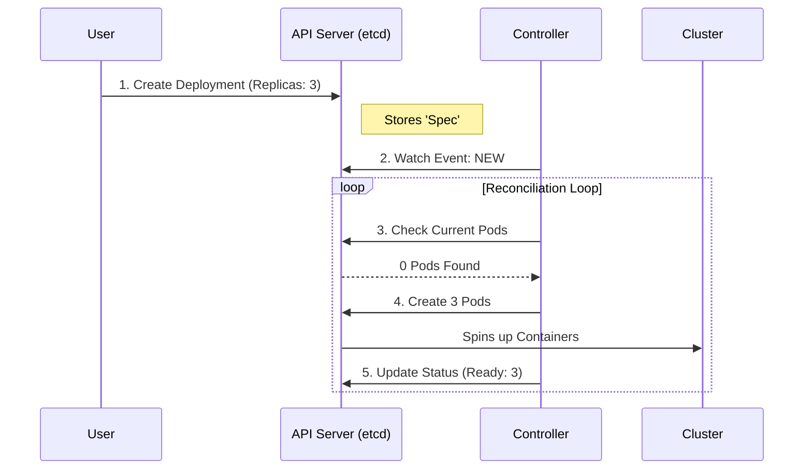
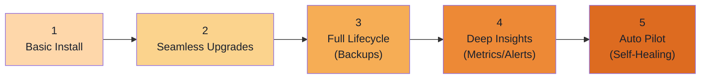

# 🧊 Kubernetes Operators — Part 1: Core Concepts & Architecture

---

## 🏗️ 1. Kubernetes Architecture (The Engine)

Before understanding Operators, we must understand the environment they live in. 

### The Real World vs. The K8s Illusion (Virtualization)
When you run a local cluster (like **k3d**), your laptop (The Host) creates a Linux Virtual Machine (The Slice). Inside that VM, k3d runs multiple Docker containers. 
- Container 1 acts as the **Master Node**.
- Containers 2 & 3 act as **Worker Nodes**.
To Kubernetes, these look like 3 physical computers connected by network cables!

### The Core Components
1. **API Server:** The Hub. Everyone (Controllers, Schedulers, You) talks ONLY to the API Server.
2. **etcd:** The Brain. The highly-available key-value store holding the entire state of the cluster.
3. **Controller Manager:** The Engine. Runs core background loops (like the ReplicaSet Controller).
4. **Scheduler:** The Dispatcher. Decides *where* to place new Pods based on resources.

---

## 🕹️ 2. The Controller Pattern

Every Kubernetes resource is divided into two halves:
1. **`spec`**: The Desired State (What you asked for).
2. **`status`**: The Actual State (What is real right now).

**Controllers** are infinite loops that constantly try to make the Actual state match the Desired state.

---

## 🤖 3. What is an Operator?

**Definition:** An Operator is "Operational Knowledge encoded as Software." It replaces the human system administrator.

A standard K8s Controller knows how to manage generic things (Pods, Services). An **Operator** is a custom controller that knows how to manage a *specific, complex application* (like a PostgreSQL Database, or a Prometheus monitoring stack).

### The Three Parts of an Operator
1. **CRD (Custom Resource Definition):** The API schema. It defines *what* the user can ask for (e.g., a `PostgresDB` resource).
2. **Controller:** The brain actively watching the API server.
3. **Business Logic:** The specialized knowledge. (e.g., "To back up Postgres, I must trigger pg_dump").

### When Do You Need an Operator?
| Tool | Use Case |
|---|---|
| **ConfigMaps / Secrets** | Simple key-value data injections (Environment variables). |
| **Helm Charts** | Deploying a static application once (Templating). |
| **Operators** | Managing **Day 2 Operations**: Backups, automated scaling, seamless version upgrades, failover handling. |

---

## 🛡️ 4. Operator Golden Rules

To survive in a chaotic distributed system, Operators must adhere to strict principles:

### A. Idempotency
*   **Definition:** Doing something 10 times should produce the exact same final result as doing it 1 time.
*   **Why?** Network errors mean your Operator might receive the same "Create Pod" event twice. If it creates 2 Pods instead of 1, your logic is flawed.
*   **Rule:** *Always check if a resource exists before taking action.*

### B. Statelessness
*   **Definition:** The Operator should hold zero truth in its own memory.
*   **Why?** If the Operator's Pod crashes and restarts, it must be able to pick up exactly where it left off by reading the single source of truth: the Kubernetes `etcd` API.

---

## 📈 5. Operator Capability Levels

Operators can be incredibly simple or astonishingly complex. The Operator Framework defines 5 levels of maturity:

