# 🧊 Kubernetes Operators — Part 2: Kubebuilder & Project Anatomy

---

## 🏗️ 1. The Kubebuilder Workflow

**Kubebuilder** is the official framework that scaffolds Opeartors in Go natively for Kubernetes.


### Essential Commands
- **`kubebuilder init`**: Sets up the Go module, Makefile, and `cmd/main.go`.
- **`kubebuilder create api`**: Scaffolds the Custom Resource (`api/`) and the Controller logic (`internal/`).
- **`make generate`**: Translates your Go structs into K8s DeepCopy methods.
- **`make manifests`**: Translates your Go structs and markers into real CRD YAML files.

---

## 🗺️ 2. Top-Level Project Structure

When you initialize a project, it generates a massive file tree. Here is what it all means:

| File / Folder | Purpose & Details |
| :--- | :--- |
| **`cmd/main.go`** | **The Bootloader.** The entry point that configures and starts the Manager. |
| **`api/v1/`** | **The Schema.** Contains your Go structs defining the Spec and Status of your Custom Resource. |
| **`internal/`** | **The Brain.** Contains the `_controller.go` files with your Reconcile loops. |
| **`config/`** | **The Manifests.** Contains Kustomize folders (crd, rbac, manager, default) to deploy your operator. |
| **`Makefile`** | **The Control Center.** Used for building, generating code, and deploying to the cluster. |
| **`PROJECT`** | **Saved State.** Stores the domain/repo config so Kubebuilder remembers context for subsequent commands. |
| **`go.mod` / `go.sum`** | **Dependencies.** Defines what external libraries (like `client-go`) are required. |

---

## 📚 3. The "Holy Trinity" Libraries

Behind every Kubebuilder project are three foundational Go libraries provided by Kubernetes SIGs:

1. **`k8s.io/apimachinery` (Data Model):** Defines what K8s data actually looks like (GroupVersionKind mappings, JSON structs, meta tags).
2. **`k8s.io/client-go` (Messenger):** The REST client. Defines exactly *how* to authenticate to and communicate with the API Server.
3. **`sigs.k8s.io/controller-runtime` (Framework):** The high-level wrapper. Provides the Manager, Cache, and Reconciler Loop abstractions so you don't have to write raw HTTP loops.

---

## 🏷️ 4. API Versioning Strategy

As you add features to your CRD, the API schema changes. Kubernetes strongly enforces Versioning to prevent breaking live clusters.

```mermaid
graph LR
    A["**v1alpha1**<br/>🧪 Experimental<br/>(Can break easily)"] --> B["**v1beta1**<br/>🚧 Beta<br/>(Stable, mostly locked)"]
    B --> C["**v1**<br/>✅ Prod<br/>(Breaking changes forbidden)"]
    
    style A fill:#fc8181,color:#1a202c
    style B fill:#f6ad55,color:#1a202c
    style C fill:#68d391,color:#1a202c
```



*(Note: Kubebuilder supports Conversion Webhooks to translate objects between v1alpha1 and v1 simultaneously on the fly!)*

---

## ✍️ 5. Kubebuilder Validation Markers

Instead of writing complex Go validation logic inside your Reconciler, KubeBuilder uses special **Markers** (`// +kubebuilder:validation:...`).

When you run `make manifests`, a tool reads these comments and statically compiles them into **OpenAPI v3 Validation Schemas** inside your CRD YAML file.

### Why is this good?
If a user submits a bad YAML (e.g., asking for -5 replicas), the Kubernetes API Server rejects it instantly *before* it ever reaches your Operator's memory!

### Common Marker Examples

```go
// Marks the field as strictly required by the user
// +kubebuilder:validation:Required
Message string `json:"message"`

// Ensures value is >= 1 (Prevents 0 or negative numbers)
// +kubebuilder:validation:Minimum=1
Replicas int32 `json:"replicas"`

// Restricts input to a specific set of allowed strings
// +kubebuilder:validation:Enum=Pending;Running;Failed
Status string `json:"status"`

// Enforces a strict Regex pattern (e.g., standard DNS formatting)
// +kubebuilder:validation:Pattern=`^[a-z0-9]([-a-z0-9]*[a-z0-9])?$`
Name string `json:"name"`
```
