# 🧊 Kubernetes Operators — Part 3: Controller-Runtime Mechanics

---

## ⚙️ 1. Controller-Runtime Core Components

`controller-runtime` is the foundational library that makes Kubebuilder possible. It provides high-level abstractions over K8s client-go.

### The Big Four

| Component | Responsibility | Description |
|---|---|---|
| **Manager** | The Boss | Coordinates everything. Runs the Reconcilers, manages the local Cache, provides the Client, and handles API type registration (Scheme) and Leader Election. |
| **Reconciler** | The Workers | Houses your specific business logic. The `Reconcile` loop. |
| **Client** | The Bridge | The interface you use to Read (from Cache) and Write (to API). |
| **Cache** | The Memory | A local, blazing-fast copy of the cluster state maintained by Informers. |

```mermaid
graph TB
    MGR["👔 Manager"] -->|"runs"| REC["🛠️ Reconcile() Loop"]
    MGR -->|"provides"| CLIENT["🔌 K8s Client"]
    MGR -->|"maintains"| CACHE["💾 Local Cache"]
    
    REC -.->|"client.Get() reads from"| CACHE
    REC -.->|"client.Update() writes to"| API["☸️ API Server"]
    CACHE -.->|"Watches stream updates from"| API

    style MGR fill:#2d3748,stroke:#f6ad55,color:#e2e8f0
    style API fill:#1a202c,stroke:#68d391,color:#e2e8f0
```



---

## 🔄 2. The Reconciliation Loop

The core function of your operator is the `Reconcile` method:

```go
func (r *MyReconciler) Reconcile(ctx context.Context, req ctrl.Request) (ctrl.Result, error)
```

**Crucial Detail:** `req` contains *only* the **Namespace** and **Name** of the object that triggered the event. It does **NOT** contain the object data! You must explicitly fetch it from the Cache.

### Return Values: `ctrl.Result`
Your Reconciler tells the Manager what to do next by returning a Result.

| Return Value (`ctrl.Result`) | Meaning | When to use |
|---|---|---|
| `return ctrl.Result{}, nil` | **Success.** Reconcile complete. | The current state matches desired state. Stop until next event. |
| `return ctrl.Result{Requeue: true}, nil` | **Retry Immediately.** Run again right now. | Waiting for an immediate sub-resource creation. |
| `return ctrl.Result{RequeueAfter: 30 * time.Second}, nil` | **Retry Later.** Delay the next run. | Waiting on external dependencies or polling long-running tasks. |
| `return ctrl.Result{}, fmt.Errorf("bad")` | **Error.** Requeue with backoff. | Network failures, bad permissions. Framework handles the backoff automatically. |

---

## ⚡ 3. Under the Hood: Watches and Informers

How does the Operator know a Pod was deleted without spamming the API continuously?

### 1. The Low-Level "Watch"
A Watch is a persistent HTTP connection to the API Server. Every time an object changes, the server streams a tiny JSON event `{"type":"DELETED", "object": {...}}`.

### 2. The High-Level "Informer" (The Cache)
Raw Watches drop if the network blips. `controller-runtime` uses **Informers** to fix this:
1. **Reflector:** Reconnects dropped Watches automatically and syncs any missing events.
2. **Local Cache:** Stores a copy of the active objects in local memory.
3. **Indexer:** Organizes the memory cache so querying is instant.

> **💡 The Golden Performance Rule:** 
> When you call `r.Get()` or `r.List()` inside your Reconciler, **it never hits the network.** It reads instantly from the Informer's local memory cache. All *Writes* (`Create`/`Update`/`Patch`) go directly to the API server over the network.

---

## 🖇️ 4. Dependency Management

Often, an operator needs other things to exist before it can do its job.

| Type | Definition | Operator Action Example |
|---|---|---|
| **Internal Dependencies** | Depends on another K8s resource in the *same cluster*. | "I need a `Secret` before I create my DB." -> Check if `Secret` exists. If not, log "Waiting for Secret" and `RequeueAfter: 5s`. |
| **External Dependencies** | Depends on cloud infra outside the cluster. | "I need an AWS VPC to be 'Available'." -> Query AWS API. If 'Pending', log "Waiting on VPC" and `RequeueAfter: 30s`. |

---

## 👑 5. System Patterns

### A. Leader Election (The "Highlander" Rule)
In production, you deploy 3 replicas of your Operator Pod for high availability. But if all 3 try to manage the same Database simultaneously, chaos ensues!

**The Fix:** Leader Election. When the Manager starts, the 3 pods fight to hold a **Kubernetes Lease Object** (a lock file in `etcd`). Only the winner (The Leader) actually runs the Reconcile loops. The others idle. If the Leader crashes, the lease expires, and another pod grabs it.

### B. DeepCopy (Protecting the Cache)

Go uses pointers. If you fetch a Pod from the Cache, the Manager gives you a pointer directly to its memory bank.

**The Danger:** If you (`pod.Spec.Replicas = 5`) modify that pointer directly to prepare an update, you just corrupted the global shared Cache for every other controller!

**The Fix:** Kubebuilder generates `DeepCopy()` methods for all your API structs. You must clone objects before modifying them, or use safe Patching functions that abstract this away.
