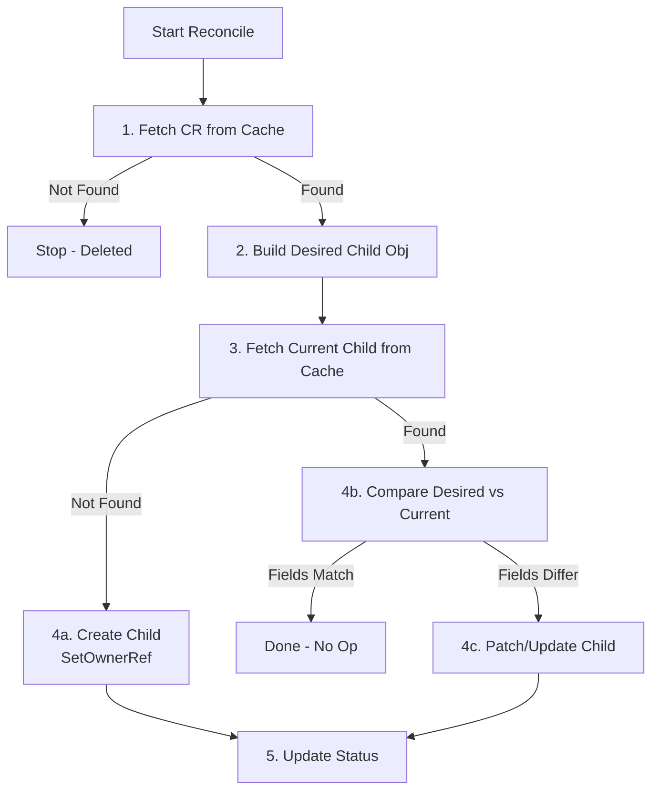

# 🧊 Kubernetes Operators — Part 4: Coding The Logic

---

## 🛠️ 1. Wiring it all up: `SetupWithManager`

Before your `Reconcile` loop ever runs, you must tell the Manager *what events* should trigger it. This happens during initialization.

```go
func (r *MyReconciler) SetupWithManager(mgr ctrl.Manager) error {
    return ctrl.NewControllerManagedBy(mgr).
        For(&appsv1.StatefulSet{}).    // 1. Primary Resource Watch
        Owns(&corev1.ConfigMap{}).     // 2. Secondary Resource Watch
        Watches(                       // 3. External/Arbitrary Watch
            &source.Kind{Type: &corev1.Secret{}},
            &handler.EnqueueRequestForObject{},
        ).
        Complete(r)
}
```

| Method | Purpose |
| :--- | :--- |
| **`For(&T)`** | The core object you manage. Any Create/Update/Delete on this object triggers your reconciler. |
| **`Owns(&T)`** | Child resources. If a user deletes a ConfigMap that your StatefulSet "owns", this triggers a reconcile so you can recreate it! |
| **`Watches(&T)`**| Any arbitrary resource. Example: Reconcile my DB whenever a specific Secret changes, even if I don't own it. |

---

## 💻 2. The Reconciler Struct & RBAC Markers

At the top of your controller file, you define your Reconciler and its permissions.

```go
// +kubebuilder:rbac:groups=apps,resources=statefulsets,verbs=get;list;watch;create;update;patch;delete
// +kubebuilder:rbac:groups=core,resources=configmaps,verbs=get;list;watch;create;update;patch;delete

type MyReconciler struct {
    client.Client          // Embedded: gives you r.Get(), r.Create(), etc.
    Scheme *runtime.Scheme // The type registry mapping Go Structs to K8s JSON
}
```

> **Note:** Those `// +kubebuilder:rbac` comments are critical. When you run `make manifests`, Kubebuilder reads them and generates the required ClusterRole YAML so your operator actually has permission to read/write those objects!

---

## 🔍 3. Working with Client-Go

`client.Client` is your interface to the cluster.

### A. Fetching a Single Object
```go
myObj := &appsv1.StatefulSet{}
err := r.Get(ctx, types.NamespacedName{Name: "my-sts", Namespace: "default"}, myObj)
if errors.IsNotFound(err) {
    // Graceful exit: Object was deleted!
    return ctrl.Result{}, nil
}
```

### B. Listing and Filtering Arrays
If you want to search, pass an **empty list pointer**.
```go
stsList := &appsv1.StatefulSetList{}
err := r.List(ctx, stsList, 
    client.InNamespace("default"),              // Filter 1
    client.MatchingLabels{"app": "database"},   // Filter 2
)
```

---

## 🧬 4. Setting Owner References (Garbage Collection)

If your Operator creates a child `ConfigMap` for a parent `StatefulSet`, what happens when the user deletes the StatefulSet? The ConfigMap gets orphaned!

To fix this, K8s has automatic Garbage Collection, but you must link them mathematically during creation.

```go
configMap := &corev1.ConfigMap{...}

// Set the Parent (myObj) -> Child (configMap) relationship
if err := ctrl.SetControllerReference(myObj, configMap, r.Scheme); err != nil {
    return ctrl.Result{}, err
}

r.Create(ctx, configMap)
```

---

## 🩹 5. Patch Strategies

Instead of modifying a giant struct and calling `Update()`, it is much safer in a concurrent system to use **Patching**. Patching merges only the specific fields you changed, preventing you from accidentally wiping out changes made by *other* controllers.

| Type | Description | Code Example |
|---|---|---|
| **Merge Patch** | Simple JSON overwrite. | `patch := client.MergeFrom(oldObj)`<br>`newObj.Spec.Size = 4`<br>`r.Patch(ctx, newObj, patch)` |
| **Strategic Merge** | Specifically designed for K8s. It knows that a "List of Containers" should merge based on the "Name" field, preventing complete array wipes. | *(Same as above, controller-runtime detects it automatically for K8s native objects)* |
| **JSON Patch** | Precise mathematical instructions. | `patchBytes := []byte('[{"op":"replace","path":"/spec/replicas","value":3}]')`<br>`r.Patch(ctx, obj, client.RawPatch(types.JSONPatchType, patchBytes))` |

---

## 🧵 6. Full Logic Flow Pattern (The Golden Standard)

Almost every proper reconciliation function follows this exact flow:



### The Three-Way Branch Code
```go
existingConfigMap := &corev1.ConfigMap{}
err := r.Get(ctx, req.NamespacedName, existingConfigMap)

if err != nil && errors.IsNotFound(err) {
    // 1. Doesn't exist -> CREATE
    r.Create(ctx, desiredConfigMap)
} else if err != nil {
    // 2. Real Error -> RETURN & REQUEUE
    return ctrl.Result{}, err
} else {
    // 3. Exists -> UPDATE (or Patch)
    existingConfigMap.Data = desiredConfigMap.Data
    r.Update(ctx, existingConfigMap)
}
```

### Updating the Status
Always update the `Status` subresource separately at the very end.
```go
myObj.Status.Phase = "Ready"
// Use Status().Update() instead of Update() to prevent infinite loops!
err := r.Status().Update(ctx, myObj) 
```
