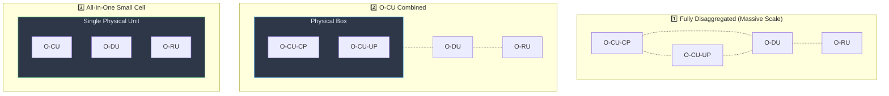
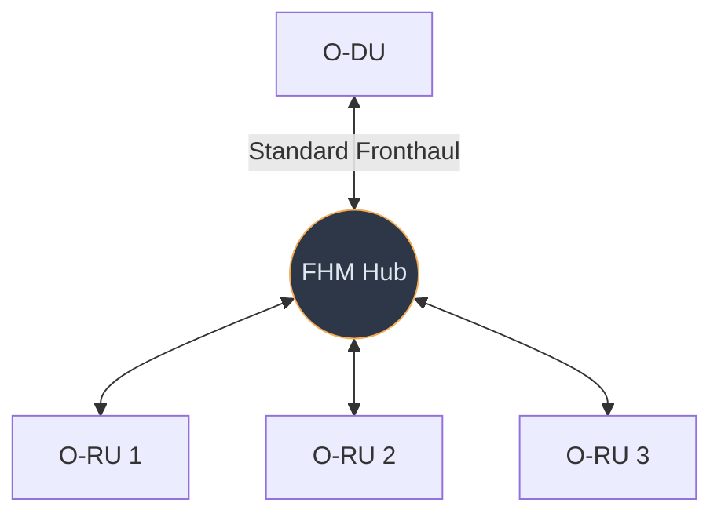
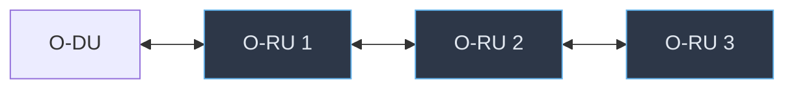
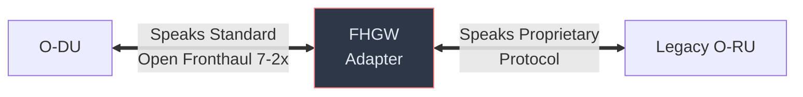
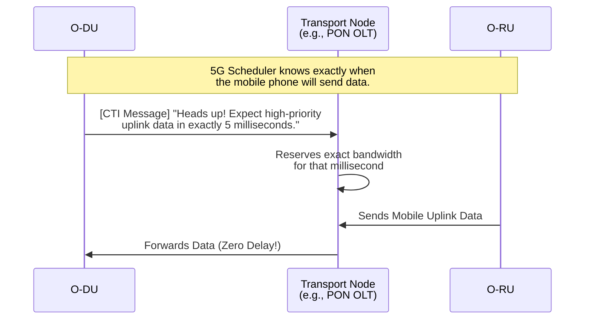

# 📘 O-RAN Architecture Notes — Part 5: Deployment Scenarios & Advanced Interfaces

> **Goal:** Understand practical O-RAN deployments. In the real world, companies don't always deploy separate physical boxes for every function. They mix, match, and merge them to save money or space. This note covers physical combinations, shared cells, gateways, transport cooperation, and carrier aggregation.

---

## 🏗️ 1. Physical Combinations (Deployment Options)

O-RAN architecture defines logical functions (O-CU-CP, O-CU-UP, O-DU, O-RU). However, these can be packaged into physical boxes in multiple ways depending on the scale and use case.



| Deployment Model | Description | Best Use Case |
|---|---|---|
| **Fully Disaggregated** | Every function runs on separate hardware. | Massive scale networks. Allows mixing different vendors for every part. |
| **O-CU Combined** | The O-CU-CP and O-CU-UP run inside a single physical server box. | Standard macro deployments to simplify the core/edge boundary. |
| **All-in-One Small Cell** | O-CU, O-DU, and O-RU are squashed into a single physical unit. Looks like a traditional Wi-Fi access point but runs 5G. | Indoor coverage, stadiums, enterprise private 5G setups. |

> 🧠 **Expert Note:** Even if these functions are squashed into one physical box (like the small cell), the standard O-RAN interfaces (like `E2`) **still exist logically inside the software**. This ensures the RAN Intelligent Controller (RIC) can still control them seamlessly, regardless of the hardware footprint!

---

## 📡 2. Shared Cell Architecture

Usually, **one radio unit (O-RU) = one cell**. 
But sometimes, you need to seamlessly cover a large, continuous area (like a long tunnel or a stadium). O-RAN defines 2 ways to hook up multiple O-RUs to a single O-DU port to create a single "Shared Cell".

### Mode 1: FHM (Fronthaul Multiplexer) — "The Hub"

The FHM sits in the middle. It copies the downlink signal from the O-DU and blasts it to all connected O-RUs at once. It also combines the uplink signals coming back before passing them to the O-DU.



### Mode 2: Cascade Mode — "The Daisy Chain"

RUs are connected in a line. Every RU in the chain has a built-in copy-and-combine function to pass the signal down the line.



| Shared Cell Mode | Topology | Pros / Cons |
|---|---|---|
| **FHM (Hub)** | Star topology | + Easy to add/remove RUs.<br>- Requires an extra piece of hardware (the FHM). |
| **Cascade (Daisy Chain)** | Linear topology | + Great for tunnels/highways. No extra hub needed.<br>- If RU #1 fails, RU #2 and #3 lose connection. |

---

## 🔌 3. Fronthaul Gateway (FHGW)

What happens if you have legacy or non-standard O-RUs that **don't** speak the standard "Open Fronthaul 7-2x" language? 

You use a **Fronthaul Gateway (FHGW)**. It sits between the O-DU and the O-RU and acts as an adapter/translator.



---

## ⏱️ 4. Cooperative Transport Interface (CTI)

### The Problem
Sometimes the cable connecting the O-DU and O-RU isn't a dedicated, empty fiber. It might be a shared network like a **PON** (Passive Optical Network) or a **DOCSIS** (Cable TV) network, where bandwidth is shared with other people (e.g., your neighbors downloading movies).

When the O-RU needs to send critical 5G upload data *right now*, the shared network might be busy!

### The Solution: CTI
The **Cooperative Transport Interface (CTI)** allows the RAN and the Transport network to coordinate.



**How it works:**
1. The O-DU scheduler knows exactly when the mobile phone will transmit.
2. The O-DU sends an advance warning via CTI to the Transport Node.
3. The Transport Node reserves bandwidth for that exact millisecond, clearing a VIP lane for the data.

---

## 🔗 5. Inter O-DU Carrier Aggregation (The D2 Interface)

### What is Carrier Aggregation (CA)?
CA is a technique where a phone connects to two different frequencies at once to double its speed (e.g., downloading on both 2GHz and 3GHz simultaneously). Usually, both of those frequencies are handled by the same O-DU.

### The Problem
What if the 2GHz radio is connected to **O-DU #1**, and the 3GHz radio is connected to **O-DU #2**? 

### The Solution: D2 Interface
The **D2 Interface** creates a direct link between the two separate O-DUs.

```mermaid
graph TD
    CU[O-CU-CP]
    
    subgraph "D2 Interface Context"
        DU1[O-DU #1<br/>(PCell / Master)]
        DU2[O-DU #2<br/>(SCell / Secondary)]
        
        DU1 <==>|D2 Interface<br/>Direct Coordination| DU2
    end
    
    PHONE((📱 User Phone))
    
    CU --- DU1
    CU --- DU2
    
    DU1 -.->|2GHz Link| PHONE
    DU2 -.->|3GHz Link| PHONE
    
    style DU1 fill:#2d3748,stroke:#63b3ed,color:#e2e8f0
    style DU2 fill:#2d3748,stroke:#9f7aea,color:#e2e8f0
    style PHONE fill:#1a202c,stroke:#f6ad55,color:#e2e8f0
```

**Key Points:**
- **Role Split:** One O-DU acts as the **PCell** (Master), and the other acts as the **SCell** (Secondary).
- **Function:** They coordinate user data directly over the D2 interface so the phone seamlessly uses both radios.
- **Requirement:** Both O-DUs **must** be connected to the exact same O-CU-CP.

---

## 📝 Quick Revision Cheat Sheet

| Term / Interface | Explanation | Analogy |
|---|---|---|
| **Small Cell** | O-CU, O-DU, and O-RU combined in one physical box. | A Wi-Fi router, but for 5G. |
| **Logical Interfaces** | `E2`, etc. exist in software even if hardware is combined. | Still speaking standard languages inside the box. |
| **Shared Cell** | Multiple O-RUs connected to one O-DU port for single-cell coverage. | Adding speakers to a room to play the same song. |
| **FHM (Multiplexer)** | Hardware hub for Shared Cells. Copies DL, combines UL. | A star-topology splitter box. |
| **Cascade Mode** | Daisy-chain topology for Shared Cells. | Christmas tree lights wired in a row. |
| **FHGW (Gateway)** | Adapter converting Open Fronthaul 7-2x to proprietary protocol. | A universal travel plug adapter. |
| **CTI Interface** | O-DU tells the Transport Node (PON) to reserve shared bandwidth. | Clearing the highway right before the ambulance arrives. |
| **D2 Interface** | Direct link between two separate O-DUs doing Carrier Aggregation. | Two teams playing together on the same field directly. |
| **PCell / SCell** | Master / Secondary roles for O-DUs during aggregation. | Captain and Lieutenant. |