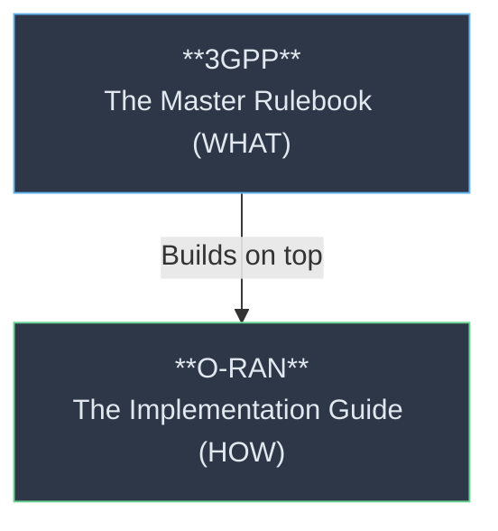
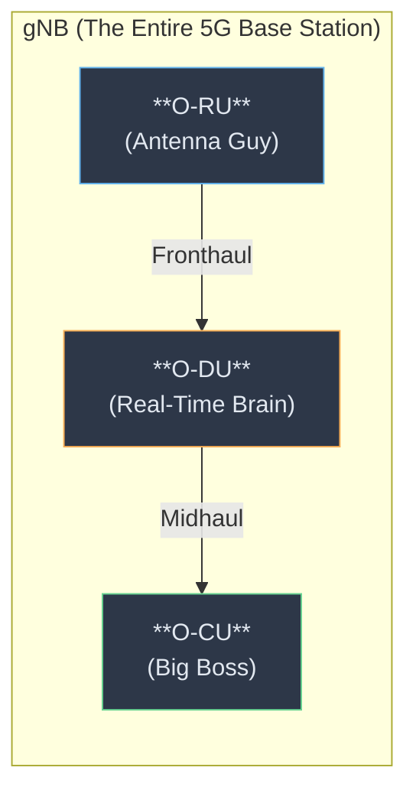
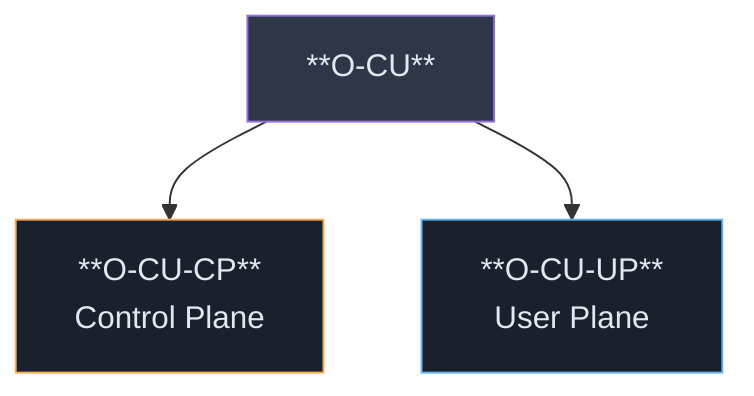
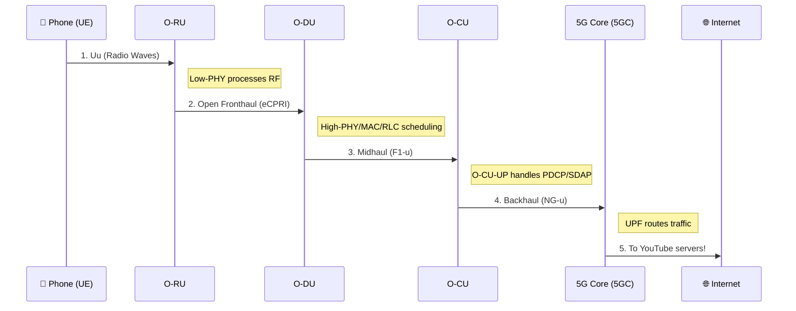

# 📘 O-RAN Study Notes — Part 1: Core Architecture & Physical Nodes

---

## 🏗️ 1. Introduction: 3GPP vs O-RAN

O-RAN **does not replace** 3GPP; it builds on top of it.

| Aspect | 3GPP | O-RAN |
|---|---|---|
| **What it is** | Global standards organization | Telecom industry alliance |
| **Defines** | **WHAT** needs to happen (the rules/protocols) | **HOW** to build it openly and intelligently |
| **Example** | "The NG interface connects Core to RAN" | "We use NG, but we split the RAN into O-CU and O-DU" |



---

## 📡 2. The 5G RAN Split (The gNB)

In 4G, the base station (eNB) was one giant, proprietary box.
In 5G O-RAN, the base station (gNB - Next Generation Node B) is **split into 3 distinct parts** to enable multi-vendor flexibility and cost savings.



### The Three Nodes Explained

| Node | Role | Analogy | Processing Needs | Ratio |
|---|---|---|---|---|
| **O-RU** (Radio Unit) | Converts digital bits ↔ analog radio waves | **The Translator** | Zero delay (instant) | 10-20 per DU |
| **O-DU** (Distributed Unit) | Real-time heavy signaling/processing | **The Factory Worker** | Microseconds | 1 per 10-20 RUs |
| **O-CU** (Centralized Unit) | Non-real-time logic (security, handovers) | **The Manager** | Milliseconds | 1 per 100s of DUs |

---

## ✂️ 3. The Splits: O-CU Split and 7.2x Fronthaul Split

### A. The O-CU Split (Control vs. User Plane)
For efficiency, the O-CU is divided into a brain (CP) and a muscle (UP).



| Feature | O-CU-CP (Control Plane) | O-CU-UP (User Plane) |
|---|---|---|
| **Role** | Decision making (Signaling, Call Setup, Handovers) | Data movement (Video, Web traffic, Encryption) |
| **Analogy** | **Airport Security** (Checks if you can board) | **Baggage Handler** (Moves the actual luggage) |
| **Protocol**| RRC, PDCP (Control) | SDAP, PDCP (User) |

### B. Functional Split 7.2x (Fronthaul)
O-RAN chose "Split 7.2x" for the Fronthaul interface (between O-DU and O-RU). This puts the "Low-PHY" in the O-RU and the "High-PHY" in the O-DU.

> 📦 **The IKEA Analogy:**
> - **O-DU sends:** Flat-pack furniture (compressed, math-heavy digital data).
> - **O-RU's Low-PHY:** Assembles the furniture (iFFT, Beamforming, Cyclic Prefix) into the final radio waveform.
> - **Why?** It keeps the fronthaul data stream small enough to travel over standard fiber optics (eCPRI) instead of requiring insanely expensive, massive pipes.

---

## 🗺️ 4. Protocol Mapping across Nodes

Here is where the 3GPP software protocols actually live inside the O-RAN boxes:

| Node | Protocols Handled | Primary Job |
|---|---|---|
| **O-CU-CP** | RRC, PDCP-C | Connection management, Security policies |
| **O-CU-UP** | SDAP, PDCP-U | QoS mapping, Traffic encryption |
| **O-DU** | RLC, MAC, High-PHY | Error correction (HARQ), Traffic scheduling |
| **O-RU** | Low-PHY, RF | Beamforming, Digital-to-Analog conversion |

---

## 📍 5. The Physical Map: Where Do These Boxes Live?

Because of latency requirements, you can't put everything in one data center.

```mermaid
graph TD
    PHONE["📱 Your Phone<br/>(e.g., at a Cafe)"] -.->|RF Link| RU
    
    subgraph "City Map"
        RU["**O-RU**<br/>On the Cafe Rooftop<br/>(Requires line-of-sight/proximity)"] -->|< 20km (Dark Fiber)| DU
        
        DU["**O-DU**<br/>Street Cabinet / Local Exchange<br/>(Neighborhood level)"] -->|City Fiber| CU
        
        CU["**O-CU**<br/>Regional Data Center / Cloud<br/>(City level)"]
    end
    
    style PHONE fill:#1a202c,stroke:#f6ad55,color:#e2e8f0
    style RU fill:#2d3748,stroke:#63b3ed,color:#e2e8f0
    style DU fill:#2d3748,stroke:#68d391,color:#e2e8f0
    style CU fill:#2d3748,stroke:#9f7aea,color:#e2e8f0
```

---

## 🎬 6. End-to-End: The Journey of a Video Call

Let's trace the complete path from your phone to the internet:


