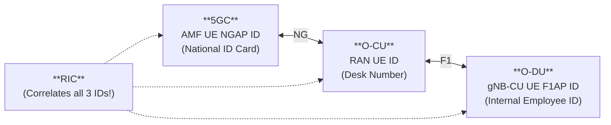
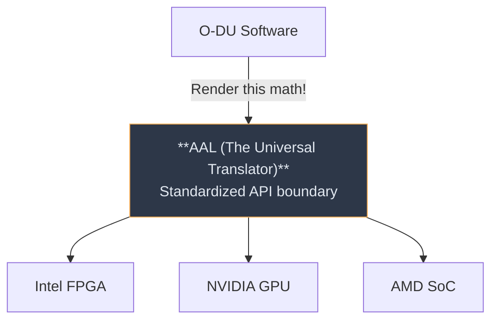

# 📘 O-RAN Study Notes — Part 2: Interfaces, Planes & Data Flow

---

## 🔌 1. The Master Interface Guide

O-RAN is defined by its open interfaces. There are internal RAN interfaces, intelligence interfaces, and core interfaces.

### Core Data Path (Left to Right)
| Interface | Connects | Purpose / Protocol | Analogy |
|---|---|---|---|
| **Uu** | Phone (UE) ↔ O-RU | The actual wireless radio waves (RF) | "The air between you and the tower" |
| **Open FH** | O-RU ↔ O-DU | Fronthaul data. Uses **eCPRI** | "Express highway - no delays allowed" |
| **F1** | O-DU ↔ O-CU | Midhaul. Split into **F1-c** (Control) and **F1-u** (User Data) | "Standard city highway" |
| **E1** | O-CU-CP ↔ O-CU-UP | Internal coordination within the CU | "Intercom between departments" |
| **NG** | O-CU ↔ 5GC (Core) | Backhaul. **NG-c** goes to AMF (Signaling), **NG-u** to UPF (Data) | "The massive interstate" |

### Intelligence & Management Interfaces
| Interface | Connects | Purpose | Speed / Analogy |
|---|---|---|---|
| **O1** | SMO ↔ All NFs | FCAPS (Faults, Config, Accounting, Performance, Security) | **Slow** / "IT Help Desk" |
| **O2** | SMO ↔ O-Cloud | Cloud resource management (Servers, not radio software) | **Slow** / "Cloud Admin" |
| **A1** | Non-RT RIC ↔ Near-RT RIC | ML models, long-term policies ("Prioritize video") | **Slow** / "Strategy Memo" |
| **E2** | Near-RT RIC ↔ Nodes | Tactical telemetry and quick control actions | **Fast** / "Walkie-Talkie" |
| **Y1** | Near-RT RIC ↔ Y1 Consumer | External subscription for analytics (e.g., Drone companies) | **Varies** / "Data Feed" |

### Peer-to-Peer Interfaces (Handovers)
| Interface | Connects | Purpose |
|---|---|---|
| **X2** | eNB ↔ eNB (or gNB) | 4G handovers, or mixed 4G/5G Non-Standalone mode |
| **Xn** | gNB ↔ gNB | Pure 5G handovers between two O-CUs |

---

## 🔲 2. The Four Planes of Open Fronthaul

The Open Fronthaul (O-DU to O-RU) is strictly divided into four logical communication "planes."

| Plane | Name | Role | Characteristics | Analogy |
|---|---|---|---|---|
| **C-Plane** | Control | **The Manager:** Tells O-RU what to do ("Aim beam here at T+5ms") | Real-time, MUST arrive before U-Plane | 🚦 Traffic Cop |
| **U-Plane** | User | **The Cargo:** Carries the actual digitized radio waveform (**IQ Samples**) | Fast, bulk data | 📦 Cargo Truck |
| **S-Plane** | Sync | **The Metronome:** Keeps devices perfectly synchronized to the microsecond | Uses PTP + SyncE. Critical to prevent 5G crashes | ⏱️ Orchestra Conductor |
| **M-Plane** | Mgmt | **The IT Admin:** Handles startup, software updates, health checks | Non-real-time. Uses NETCONF/YANG | 🔧 IT support |

### 🔬 Deep Dive: What are IQ Samples?
The U-Plane doesn't send "a JPEG" or "audio." It sends **IQ Samples**, which describe the exact physical shape of a radio wave mathematically at any given nanosecond. 
> *Analogy: Describing a wave in the ocean by sending precise height and direction measurements, rather than sending buckets of water.*

---

## 🥞 3. The Protocol Stack (Fronthaul)

How exactly does data cross the Fronthaul cable?

1. **L4 (Protocol Handlers):** PTP (for S-Plane) and NetConf (for M-Plane).
2. **L3 (eCPRI):** *Enhanced Common Public Radio Interface.* Takes the constant, heavy flow of raw radio data (old CPRI) and chops it up into efficient, packetized chunks.
3. **L2 (Ethernet MAC):** Uses standard MAC addresses to route the eCPRI packets.
4. **L1 (Ethernet PHY):** The actual fiber optic cables and electrical pulses.

---

## 🪪 4. UE Associated Identifiers ("Who is User X?")

When the network is sliced into so many boxes, tracking a single phone call is hard. The network uses different IDs at different stages, and the **RIC** correlates them.

If the O-DU reports a problem with "User 123", and the O-CU reports a drop for "User ABC", the RIC looks at its mapping table to realize *they are the same phone*.

---

## 🏎️ 5. AAL (Acceleration Abstraction Layer)

**The Problem:** Standard CPU servers in the cloud are too slow to do heavy Radio Layer 1 math (like Forward Error Correction). They need hardware accelerators (NVIDIA GPUs, Intel FPGAs). But code written for an Intel chip won't work on an NVIDIA chip.
**The Solution:** The **AAL**.

**Benefits:** The O-DU software developers write their code once. AAL translates the heavy math down to whatever specific accelerator chip is plugged into the server.
