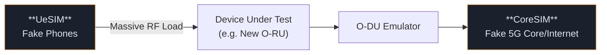

# 📘 O-RAN Study Notes — Part 4: Physical Deployments & Testing

---

## 🏗️ 1. Physical Combinations

Though O-RAN defines logical functions (O-CU-CP, O-CU-UP, O-DU, O-RU), telecom operators package them into physical hardware boxes in multiple ways depending on the use case.

| Deployment Model | What goes in the box? | Best Use Case |
|---|---|---|
| **Fully Disaggregated** | Every function runs on isolated, separate hardware. | Massive scale networks. Maximum vendor diversity. |
| **O-CU Combined** | O-CU-CP + O-CU-UP in one server. | Standard macro deployments. Simplifies core/edge boundary. |
| **All-in-One Small Cell** | O-CU + O-DU + O-RU perfectly combined in one box. | Stadiums, indoor Wi-Fi replacements, Enterprise Private 5G. |

> 🧠 **Expert Note:** Even if squashed into an "All-in-One Small Cell", the standard logical interfaces (like `E2`) **still exist in software**. The RIC can still control them perfectly!

---

## 📡 2. Shared Cells and Topologies

Normally, one O-RU equals one cell. But sometimes you want a massive, continuous coverage area without handovers (like inside a tunnel or mall). O-RAN supports connecting **multiple O-RUs to one O-DU port**.

### A. Fronthaul Multiplexer (FHM) — "The Hub"
Provides a **Star Topology**. The FHM hardware copies the downlink signal and blasts it to all RUs. It combines their uplinks.
* **Pro:** Easy to swap broken RUs without bringing the network down.
* **Con:** Requires extra hardware expenses.

### B. Cascade Mode — "The Daisy Chain"
Provides a **Linear Topology**. You wire DU → RU1 → RU2 → RU3. Every RU has a built-in copy/combine chip.
* **Pro:** Great for tunnels/highways. Very cheap to deploy.
* **Con:** If RU1 breaks, RU2 and RU3 go completely dark.

---

## 🚇 3. Specialized Gateways and Transports

Real-world deployments face weird legacy hardware and shared cables. O-RAN has fixes for this:

| Technology | Problem Solved | Description |
|---|---|---|
| **FHGW (Fronthaul Gateway)** | O-DU uses Open Fronthaul 7.2x, but the O-RUs are old proprietary 4G hardware. | Sitting between them, the FHGW translates Open 7.2x into a proprietary protocol. |
| **CTI (Cooperative Transport Interface)**| O-RU and O-DU share a home fiber line (PON) instead of having dedicated fiber. | The O-DU sends advance warning to the fiber node to reserve bandwidth for precise millisecond bursts. |
| **D2 Interface**| Carrier Aggregation (Double speed phone connection) usually requires one O-DU. What if your phone connects to two separate O-DUs? | The **D2** links the two O-DUs directly. One becomes the **PCell** (Master), one becomes the **SCell** (Secondary). |

---

## 🧪 4. Simulation & Validation

You cannot test new O-RAN software by connecting it to the live public internet. Operators use extremely complex hardware simulators.

### O-RU Conformance Test Setup Demystified
Testing a brand new Radio Unit involves a "pizza shop" approach.
1. **The DU Emulator (Left Box):** Acts as the fake brain. Sends thousands of C-Plane and U-Plane commands ("Deliver this pizza!").
2. **The DUT (Device Under Test):** The actual O-RU hardware. 
3. **Signal Analyzers (Right Box):** The "Quality Inspectors" catching the resulting radio waves either directly over a wire (**Conducted**) or through antennas (**Over-The-Air / OTA**).

> **Critical Note:** The DU Emulator and Signal Analyzers must be linked by a physical timing wire. If they aren't perfectly synchronized, the Analyzer won't know exactly when to look for the O-RU's transmission burst!

---
*(End of Consolidated Architecture Study Guide Series)*
